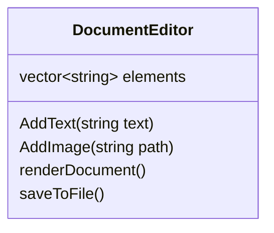

# Document Editor — Basic Design (Before SOLID)

Preview this markdown with **Cmd/Ctrl + Shift + V**.

Hi folks,

Let's design a simple Google Docs–like structure with minimal requirements. We start with the smallest thing that could work, then see why it breaks down in interviews and real codebases.

> **Code:** [`basic.ts`](./basic.ts) — run with `npm run demo:basic`

---

## The Naive Design

At first glance, one class feels enough: store content, render it, save it.



We store everything as strings (`"TEXT:hello"`, `"IMAGE:/path.png"`) so order is preserved and we don't need separate types yet. Rendering is cached so we don't rebuild output on every read.

---

## How It Works (Walkthrough)

| Step                   | What happens                                |
| ---------------------- | ------------------------------------------- |
| `addText("Hello")`     | Pushes `"TEXT:Hello"` into `elements[]`     |
| `addImage("/cat.png")` | Pushes `"IMAGE:/cat.png"` into `elements[]` |
| `renderDocument()`     | Loops strings, parses prefix, joins lines   |
| `saveToFile(path)`     | Calls `renderDocument()`, writes to disk    |

Simple. Works for a demo. But ask yourself:

- Does this follow **SOLID**?
- Is it **scalable**?
- Can we add **Video** without touching existing logic?
- Is it worth writing production code like this?

**Short answer: no.** That's exactly why we refactor.

---

## SOLID Violations (Teaching Table)

| Principle                     | Violated? | Why                                                                  |
| ----------------------------- | --------- | -------------------------------------------------------------------- |
| **S** — Single Responsibility | ✅ Yes    | `DocumentEditor` owns content **and** rendering **and** file I/O     |
| **O** — Open/Closed           | ✅ Yes    | New element type = edit `renderDocument()` + possibly `saveToFile()` |
| **L** — Liskov Substitution   | ➖ N/A    | No polymorphic types — everything is a string                        |
| **I** — Interface Segregation | ➖ N/A    | No interfaces — one fat class                                        |
| **D** — Dependency Inversion  | ✅ Yes    | Editor is tied to **file** storage; cannot inject DB or cloud        |

---

## Concrete Pain Points

### 1. Stringly-typed content

```typescript
// basic.ts — type information lives in string prefixes
this.elements.push(`TEXT:${text}`);
this.elements.push(`IMAGE:${path}`);
```

Adding `VIDEO` means inventing `"VIDEO:..."`, then updating every `if/else` that parses elements. Easy to typo, hard to test.

### 2. God class

```typescript
renderDocument() { /* rendering logic here */ }
saveToFile()   { /* persistence logic here */ }
```

If rendering rules change (HTML vs plain text), you edit the same class that handles saving. Two reasons to change = SRP violation.

### 3. Hard-coded persistence

```typescript
saveToFile(filePath: string): void { ... }
```

The method name itself assumes files. Switching to PostgreSQL or S3 requires renaming, rewriting, and retesting the entire editor.

---

## When Is This Acceptable?

Honestly? **Prototypes, throwaway scripts, or the first 30 minutes of a hackathon.** For an LLD interview or any system that will grow, this is the "before" picture — the motivation for the improved design.

---

## Next Step

Read **[improved-design_docs.md](./improved-design_docs.md)** and run **[improved.ts](./improved.ts)** to see the same features with proper separation of concerns and pluggable persistence.

```bash
npm install
npm run demo:basic    # this design
npm run demo:improved # SOLID refactor
```
