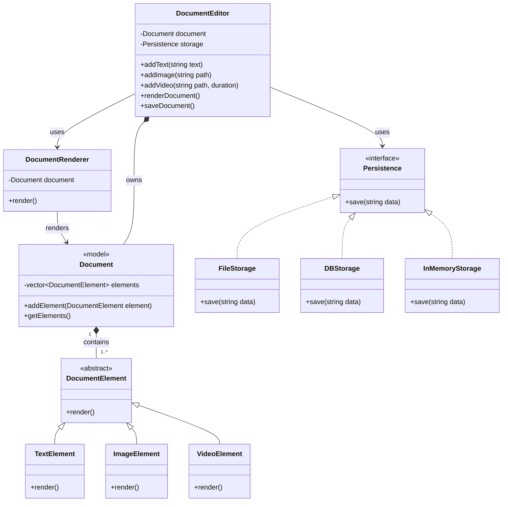

# Document Editor — Improved Design (SOLID)

Preview this markdown with **Cmd/Ctrl + Shift + V**.

We refactored the basic editor by **delegating** each responsibility to its own class. The result supports new content types and storage backends without modifying existing code.

> **Code:** [`improved.ts`](./improved.ts) — run with `npm run demo:improved`

---

## Class Diagram



---

## Architecture Overview

See implementation to get more understanding

```
┌─────────────────────────────────────────────────────────┐
│                   DocumentEditor                        │
│  (orchestrator — knows WHAT to do, not HOW)             │
│                                                         │
│   addText / addImage / addVideo                         │
│   renderDocument()  ──► DocumentRenderer                │
│   saveDocument()    ──► Persistence (injected)          │
└─────────────────────────────────────────────────────────┘
         │                              │
         ▼                              ▼
   ┌──────────┐              ┌──────────────────┐
   │ Document │              │ FileStorage      │
   │ (model)  │              │ DBStorage        │
   └──────────┘              │ InMemoryStorage  │
         │                   └──────────────────┘
         ▼
   DocumentElement[]
   Text / Image / Video
```

---

## SOLID — Principle by Principle

### S — Single Responsibility Principle

> _A class should have only one reason to change._

See how every class holds this Principle

| Class                                         | Single job                            |
| --------------------------------------------- | ------------------------------------- |
| `Document`                                    | It holds ordered list of elements     |
| `TextElement`, `ImageElement`, `VideoElement` | They Know how **one** block renders   |
| `DocumentRenderer`                            | Turn document → string output         |
| `FileStorage` / `DBStorage`                   | Persist rendered output               |
| `DocumentEditor`                              | Wire user actions to model + services |

**Before:** one class changed when rendering format changed _or_ storage changed.  
**After:** change `DocumentRenderer` for HTML output; change `DBStorage` for a new DB — editor untouched.

---

### O — Open/Closed Principle

> _Open for extension, closed for modification._

We added `VideoElement` **without** editing `Document`, `DocumentRenderer`, or `DocumentEditor`:

```typescript
export class VideoElement extends DocumentElement {
  render(): string {
    return `[Video: ${this.path} (${this.durationSec}s)]`;
  }
}
```

The renderer already calls `element.render()` on every element — polymorphism handles the rest.

---

### L — Liskov Substitution Principle

> _Subtypes must be substitutable for their base type._

Any `DocumentElement` can sit in the document and be rendered:

```typescript
document.addElement(new TextElement("Hi"));
document.addElement(new ImageElement("/a.png"));
document.addElement(new VideoElement("/v.mp4", 60));
// Renderer works the same — no special cases
```

If a new element broke rendering (e.g. threw unexpectedly), it would violate LSP. Our elements all honor the `render(): string` contract.

---

### I — Interface Segregation Principle

> _Clients should not depend on methods they don't use._

We use **small** contracts:

- `DocumentElement` → only `render()`
- `Persistence` → only `save(data: string)`

The editor never sees file paths or SQL — it only calls `storage.save()`. No fat "do everything" interface.

---

### D — Dependency Inversion Principle

> _Depend on abstractions, not concretions._

```typescript
// Editor depends on Persistence interface — NOT FileStorage
constructor(private readonly storage: Persistence) { ... }

// Caller chooses implementation at runtime:
new DocumentEditor(new FileStorage("doc.txt"));
new DocumentEditor(new DBStorage("postgres://...", "documents"));
new DocumentEditor(new InMemoryStorage()); // tests
```

Same editor, three backends. That's the Strategy pattern supporting DIP.

---

## Persistence Layer (Deep Dive)

Persistence is **deliberately separate** from the document model.

### Why?

1. **Rendering ≠ Storage** — You might render to HTML but store JSON ops (real Google Docs uses operational transforms; we simplify to rendered text for teaching).
2. **Environment flexibility** — Local dev uses files; production uses DB or object storage.
3. **Testability** — `InMemoryStorage` captures output with zero I/O.

### The Interface

```typescript
export interface Persistence {
  save(data: string): void;
}
```

The editor renders first, then hands a **string snapshot** to storage. Real systems might instead persist:

- Raw element JSON
- CRDT / OT operation log
- Versioned snapshots

For LLD interviews, "render then save string via strategy" is enough to demonstrate the pattern.

### Implementations

| Class             | Use case              | Demo behavior                    |
| ----------------- | --------------------- | -------------------------------- |
| `FileStorage`     | Local files, exports  | Logs fake write to `filePath`    |
| `DBStorage`       | Server-side documents | Logs INSERT with connection info |
| `InMemoryStorage` | Unit tests            | Stores `lastSaved` in memory     |

### Swapping storage (no editor changes)

```typescript
const editor = new DocumentEditor(new FileStorage("notes.txt"));
editor.saveDocument();

// Deploy to server — swap one line:
const serverEditor = new DocumentEditor(
  new DBStorage("postgres://localhost/docs", "documents"),
);
serverEditor.saveDocument();
```

---

## Data Flow

```
User calls addText("Hello")
        │
        ▼
DocumentEditor creates TextElement → Document.addElement()
        │
User calls renderDocument()
        │
        ▼
DocumentRenderer → each element.render() → joined string
        │
User calls saveDocument()
        │
        ▼
Persistence.save(renderedString)  →  File / DB / Memory
```

---

## Basic vs Improved — Quick Compare

| Concern       | Basic (`basic.ts`)       | Improved (`improved.ts`)    |
| ------------- | ------------------------ | --------------------------- |
| Content model | `string[]` with prefixes | `DocumentElement` hierarchy |
| Add video     | Edit parser + render     | Add `VideoElement` class    |
| Rendering     | Inside editor            | `DocumentRenderer`          |
| Saving        | `saveToFile()` only      | `Persistence` strategy      |
| Testing       | Hard (file I/O coupled)  | `InMemoryStorage` injection |
| SOLID         | Violates S, O, D         | Demonstrates all five       |

---

## Run the Demos

```bash
npm install
npm run demo:basic      # naive implementation
npm run demo:improved   # SOLID + persistence strategies
npm run demo            # both, back-to-back
```

---

## Interview Talking Points

1. **Start with basic** — show you can ship something simple.
2. **Name the smells** — god class, stringly types, hard-coded I/O.
3. **Refactor with SOLID** — one principle at a time, tie to class diagram.
4. **Persistence** — Strategy pattern + DIP; mention real-world variants (S3, OT log).
5. **Extension** — "Add TableElement" or "Add CloudStorage" without touching editor.

That arc — **problem → smell → principle → code** — is what interviewers want to see.
