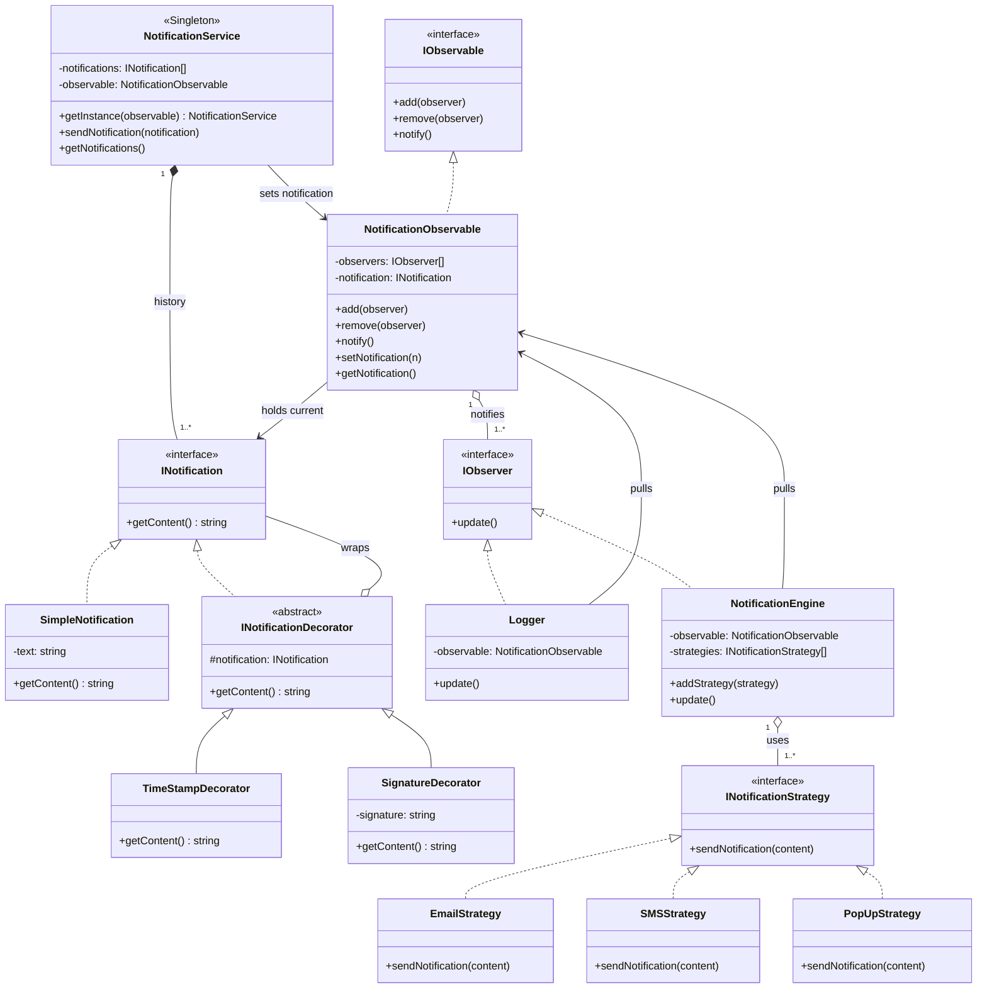

# Notification System — Design Docs

Preview this markdown with **Cmd/Ctrl + Shift + V**.

A classic interview case study: **one service** fires notifications; content can be **decorated**; interested parties **observe** updates; delivery goes through **pluggable channels**.

> **Code:** [`code.ts`](./code.ts) — run with `npm run demo:notification`

**Patterns in play:** Singleton · Decorator · Observer (pull) · Strategy

---

## Class Diagram



**Reading the UML:** `NotificationService` is the Singleton entry point. It builds / stores `INotification` objects (optionally wrapped by decorators), then hands the latest one to `NotificationObservable`. Observers pull content on `update()`. `NotificationEngine` walks its strategies and delivers via Email / SMS / PopUp.

---

## Architecture Overview

```
┌──────────────────────────────────────────────────────────┐
│              NotificationService (Singleton)             │
│   sendNotification(notif) → history + set on observable  │
└────────────────────────────┬─────────────────────────────┘
                             │
                             ▼
                  NotificationObservable
                             │
              notify() ──────┼──────────────┐
                             ▼              ▼
                          Logger     NotificationEngine
                       (log only)    (Strategy context)
                                            │
                          ┌─────────────────┼─────────────────┐
                          ▼                 ▼                 ▼
                    EmailStrategy     SMSStrategy      PopUpStrategy
```

Content is shaped **before** it hits the observable:

```
SimpleNotification("Order shipped")
        │
        ▼
TimeStampDecorator(...)     ← Decorator stack
        │
        ▼
SignatureDecorator(..., "Team Acme")
        │
        ▼
NotificationService.sendNotification(decorated)
```

---

## Pattern-by-Pattern

### 1. Decorator — build content without subclass explosion

> Same idea as [Coffee toppings](../structural_patterns/decorator_pattern/decorator.md).

| Class | Job |
|-------|-----|
| `INotification` | Contract: `getContent()` |
| `SimpleNotification` | Base text |
| `INotificationDecorator` | Holds an inner `INotification` |
| `TimeStampDecorator` / `SignatureDecorator` | Each adds one concern |

```typescript
const notif: INotification = new SignatureDecorator(
  new TimeStampDecorator(new SimpleNotification("Order shipped!")),
  "Team Acme",
);
notif.getContent();
// [2026-09-22T...] Order shipped!
// — Team Acme
```

Add a `PriorityDecorator` later **without** editing existing classes (OCP).

---

### 2. Observer (pull) — Logger + Engine react to new notifications

> Same pull UML as [Weather Station](../behavioral_patterns/observer_pattern/pull/pullObserver.md).

| Class | Role |
|-------|------|
| `IObservable` / `IObserver` | Subject / subscriber contracts |
| `NotificationObservable` | Holds current `INotification`, calls `notify()` |
| `Logger` | On `update()`, pulls and logs |
| `NotificationEngine` | On `update()`, pulls and sends via strategies |

```typescript
observable.setNotification(notif); // stores + notify()
// Logger.update()           → observable.getNotification()
// NotificationEngine.update() → same pull, then strategies
```

**Why pull?** Each observer decides what it needs. Logger only wants content; a future metrics observer might only care that *something* was sent.

---

### 3. Strategy — Email / SMS / PopUp without if/else

> Same idea as [Payment Checkout](../behavioral_patterns/strategy_pattern/strategy.md).

| Class | Job |
|-------|-----|
| `INotificationStrategy` | `sendNotification(content)` |
| `EmailStrategy` / `SMSStrategy` / `PopUpStrategy` | One channel each |
| `NotificationEngine` | Context — loops strategies on every update |

```typescript
engine.addStrategy(new EmailStrategy("user@example.com"));
engine.addStrategy(new SMSStrategy("+91-98765-43210"));
engine.addStrategy(new PopUpStrategy());
// Engine code never branches on channel type
```

---

### 4. Singleton — one NotificationService

> Same `getInstance()` idea as [Logger](../creational_patterns/singleton_pattern/singleton.md).

Why here?

- Wire observers and strategies **once**
- Shared notification history
- Call sites don't pass the service around everywhere

```typescript
const service = NotificationService.getInstance(observable);
service.sendNotification(decorated);
// Later, anywhere:
NotificationService.getInstance() === service; // true
```

First `getInstance()` must receive the observable so the singleton can own that wiring. Later calls reuse the same instance.

---

## Data Flow

```
Client builds INotification (optional Decorator stack)
        │
        ▼
NotificationService.sendNotification(n)
        │
        ├─► push n into history[]
        └─► NotificationObservable.setNotification(n)
                    │
                    └─► notify() each IObserver
                              │
              ┌───────────────┴───────────────┐
              ▼                               ▼
           Logger                    NotificationEngine
     getNotification()              getNotification()
     log content                    for each strategy:
                                      sendNotification(content)
```

---

## SOLID Touchpoints

| Principle | How this design uses it |
|-----------|-------------------------|
| **S** | Service orchestrates; Logger logs; Engine delivers; strategies own channels |
| **O** | New decorator / strategy / observer = new class, no edits to service |
| **L** | Any `INotification` is safe to decorate and send |
| **I** | Small contracts: `getContent()`, `update()`, `sendNotification(content)` |
| **D** | Engine depends on `INotificationStrategy`, not Email/SMS concrete types |

---

## Run the Demo

```bash
npm install
npm run demo:notification
```

You should see the Logger line first, then Email / SMS / PopUp output for each `sendNotification` call.

---

## Interview Talking Points

1. **Start with the flow** — create content → publish → observers react → strategies deliver.
2. **Name the patterns** — Decorator (content), Observer (fan-out), Strategy (channels), Singleton (entry point).
3. **Extension questions** — "Add Slack?" → new strategy. "Add Priority banner?" → new decorator. "Add audit trail?" → new observer.
4. **Pull vs Push** — we used pull so observers query `getNotification()`; push would pass content into `update(content)`.
5. **When Singleton hurts** — tests need `resetInstance()`; in large apps prefer DI of a single service instance instead of a global.

That arc — **problem → patterns → diagram → code** — is what interviewers want to hear.
