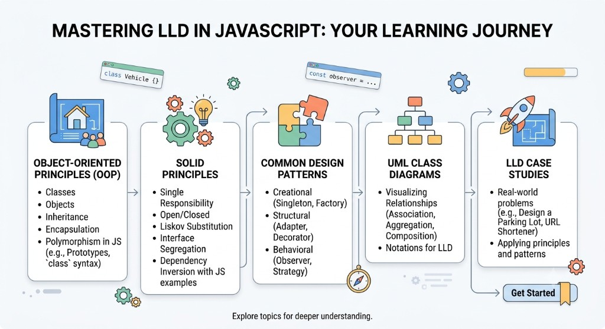

# LLD in JavaScript & TypeScript

### Low Level Design for the language you _actually_ ship with

Most LLD courses live in Java or C++. Cool. But then the interviewer says _"design it"_… and your day job is **JavaScript**.

This repo is the bridge: same interview energy, same SOLID brain, but in **JS / TS** — with docs that don't put you to sleep.

> **Pro tip:** Hit **Cmd / Ctrl + Shift + V** on any `.md` file. Mermaid diagrams and tables suddenly look _chef's kiss_.

---

## Your learning journey



We climb the ladder one rung at a time:

| Step                   | What you unlock                                                                         |
| ---------------------- | --------------------------------------------------------------------------------------- |
| **1. OOP**             | Classes, objects, inheritance, encapsulation, polymorphism (yes — even with prototypes) |
| **2. SOLID**           | Five letters that stop your codebase from becoming spaghetti                            |
| **3. Design Patterns** | Singleton, Factory, Adapter, Decorator, Observer, Strategy… the greatest hits           |
| **4. UML**             | Draw relationships so your design survives a whiteboard                                 |
| **5. Case Studies**    | Parking Lot, URL Shortener, Google Docs — apply everything                              |

No rush. Sip coffee. Break things. Fix them with better design.

---

## Why this exists (aka the interview plot twist)

Interviewer:

> _"Design a parking lot / Google Docs / notification system…"_

You:

> _opens laptop… it's JavaScript… sweating intensifies_

They expect classes, SOLID, and patterns. You expect `async/await` and React components. **Both can be true.**

| What you get           | The vibe                               |
| ---------------------- | -------------------------------------- |
| Beginner-friendly docs | Plain English first, jargon second     |
| Side-by-side learning  | Broken design → "aha" → SOLID refactor |
| Runnable TypeScript    | `npm run demo` and watch it click      |
| Interview focus        | The questions people _actually_ ask    |

---

## Wait… what even _is_ JavaScript?

**JavaScript** started as "make the button do a thing on a webpage." Plot twist: it took over the world.

Today it runs:

- **Browsers** — basically the entire internet
- **Servers** — Node.js, Deno, Bun
- **Apps** — React Native, Electron
- **Tooling** — CLIs, build tools, agents, vibes

If you write software in 2026, you'll almost definitely touch JS or its typed best friend **TypeScript**.

### The awkward truth: JS is not "OOP-first"

JavaScript is a **multi-paradigm** shapeshifter:

- Functions and closures feel like home
- Objects are flexible bags of "whatever you put in them"
- `class` (since ES6) is mostly **sugar** on top of prototypes
- For years: no real privacy, no interfaces (hello TypeScript)

So… why bother with OOP / LLD / SOLID in JS?

### Because design is about _thinking_, not syntax

| Reality check                        | What it means for you                            |
| ------------------------------------ | ------------------------------------------------ |
| Teams still ship classes & modules   | You'll read and write them                       |
| Interviews speak LLD                 | SOLID, Strategy, Factory — language doesn't care |
| Bad structure scales badly           | A 200-line god file hurts in JS _extra hard_     |
| TypeScript adds interfaces           | Suddenly DIP & ISP feel natural                  |
| React / Nest / Angular love patterns | Composition, DI, SRP show up every Tuesday       |

**Bottom line:** JS won't force good design on you. _You_ choose structure. LLD is how you choose well — so features don't turn your repo into lasagna.

---

## How to learn here (the fun way)

1. **Read the design doc** → Cmd/Ctrl + Shift + V
2. **Open the `.ts` file** → comments gossip about the "why"
3. **Run the demo** → console goes brrr
4. **Compare basic vs improved** → same feature, zero spaghetti

The magic arc every time:

> **problem → smell → principle → code**

That's interview muscle memory.

---

## Get started in 10 seconds

```bash
npm install
npm run demo                 # everything
npm run demo:basic           # Google Docs — naive
npm run demo:improved        # Google Docs — SOLID
npm run demo:simple-factory   # Nestlé Simple Factory
npm run demo:factory-method   # Nestlé Factory Method
npm run demo:abstract-factory # Nestlé Abstract Factory
npm run demo:factory          # all three factory demos
npm run demo:observer-pull    # Observer pull (Weather Station)
npm run demo:observer-push    # Observer push (Weather Station)
npm run demo:observer         # both observer demos
npm run demo:solid            # all five SOLID demos
npm run demo:srp              # Single Responsibility
npm run demo:ocp              # Open/Closed
npm run demo:lsp              # Liskov Substitution
npm run demo:isp              # Interface Segregation
npm run demo:dip              # Dependency Inversion
npm run demo:decorator        # Decorator — coffee toppings
npm run demo:singleton        # Singleton — classic Logger
npm run demo:singleton-http   # Singleton — production HttpClient
npm run demo:strategy         # Strategy — payment checkout
npm run demo:command          # Command — smart home remote
npm run demo:notification     # Case study — Notification System
```

---

## Lessons so far

### 1. Design Google Docs

Classic warm-up: model a document, render it, save it. First we do it _wrong_ on purpose. Then we make it beautiful.

| Resource                                                               | What you'll learn                          |
| ---------------------------------------------------------------------- | ------------------------------------------ |
| [basic-design_docs.md](./Design_GoogleDocs/basic-design_docs.md)       | Naive "god class" + where SOLID cries      |
| [improved-design_docs.md](./Design_GoogleDocs/improved-design_docs.md) | Full SOLID walkthrough + pluggable storage |
| [basic.ts](./Design_GoogleDocs/basic.ts)                               | Runnable anti-pattern                      |
| [improved.ts](./Design_GoogleDocs/improved.ts)                         | Runnable refactor — File / DB / In-memory  |

**One-liner:** one class that does everything → Document → Elements → Renderer → Persistence.

### 2. SOLID Principles

Five rules that keep change cheap. Each letter has a **bad vs good** TypeScript demo.

| Resource | What you'll learn |
|----------|-------------------|
| [pattern_understanding.md](./SOLID/pattern_understanding.md) | What SOLID is + why it matters |
| [SRP](./SOLID/SRP/srp.md) · [srp.ts](./SOLID/SRP/srp.ts) | One class, one reason to change (Invoice) |
| [OCP](./SOLID/OCP/ocp.md) · [ocp.ts](./SOLID/OCP/ocp.ts) | Extend discounts without editing Checkout |
| [LSP](./SOLID/LSP/lsp.md) · [lsp.ts](./SOLID/LSP/lsp.ts) | Don’t put `fly()` on penguins |
| [ISP](./SOLID/ISP/isp.md) · [isp.ts](./SOLID/ISP/isp.ts) | Split fat Worker into Workable / Eatable |
| [DIP](./SOLID/DIP/dip.md) · [dip.ts](./SOLID/DIP/dip.ts) | Inject PaymentGateway, not Stripe |

**One-liner:** S split jobs · O add classes not ifs · L honour contracts · I small interfaces · D depend on abstractions.

### 3. Factory Pattern (Nestlé)

Stop writing `new Maggi()` everywhere. Ask a factory. Same Nestlé story across all three flavors.

| Resource                                                                                       | What you'll learn                         |
| ---------------------------------------------------------------------------------------------- | ----------------------------------------- |
| [pattern_understanding.md](./creational_patterns/factory_pattern/pattern_understanding.md)     | Definition + Simple vs Method vs Abstract |
| [simpleFactory.md](./creational_patterns/factory_pattern/SimpleFactory/simpleFactory.md)       | One Nestlé plant, `createProduct(type)`   |
| [simpleFactory.ts](./creational_patterns/factory_pattern/SimpleFactory/simpleFactory.ts)       | Maggi / KitKat / Milo                     |
| [factoryMethod.md](./creational_patterns/factory_pattern/FactoryMethod/factoryMethod.md)       | India vs Swiss — one product at a time    |
| [factoryMethod.ts](./creational_patterns/factory_pattern/FactoryMethod/factoryMethod.ts)       | Same type → different Maggi               |
| [abstractFactory.md](./creational_patterns/factory_pattern/AbstractFactory/abstractFactory.md) | India vs Swiss — full combo pack          |
| [abstractFactory.ts](./creational_patterns/factory_pattern/AbstractFactory/abstractFactory.ts) | Noodles + Chocolate + Drink together      |

**One-liner:** Simple = one switch. Method = subclass picks one product. Abstract = subclass builds a matching family.

### 4. Observer Pattern (Weather Station)

One subject, many subscribers. Two delivery styles: **pull** (classic UML) and **push**.

| Resource                                                                                    | What you'll learn                      |
| ------------------------------------------------------------------------------------------- | -------------------------------------- |
| [pattern_understanding.md](./behavioral_patterns/observer_pattern/pattern_understanding.md) | Definition, standard UML, Pull vs Push |
| [pullObserver.md](./behavioral_patterns/observer_pattern/pull/pullObserver.md)              | `update()` then query the station      |
| [pullObserver.ts](./behavioral_patterns/observer_pattern/pull/pullObserver.ts)              | Phone + TV displays (pull)             |
| [pushObserver.md](./behavioral_patterns/observer_pattern/push/pushObserver.md)              | `update(data)` with weather payload    |
| [pushObserver.ts](./behavioral_patterns/observer_pattern/push/pushObserver.ts)              | Phone + TV displays (push)             |

**One-liner:** Pull = “something changed, go ask.” Push = “here’s the new data.”

### 5. Decorator Pattern (Coffee Shop)

Add toppings by wrapping — no subclass for every combo.

| Resource | What you'll learn |
|----------|-------------------|
| [pattern_understanding.md](./structural_pattern/decorator_pattern/pattern_understanding.md) | Definition, UML, when to use |
| [decorator.md](./structural_pattern/decorator_pattern/decorator.md) | Coffee + Milk / Sugar / Whip walkthrough |
| [decorator.ts](./structural_pattern/decorator_pattern/decorator.ts) | Stack wrappers at runtime |

**One-liner:** Wrap same interface → stack behaviour (`Milk(Sugar(Coffee))`) instead of class explosion.

### 6. Singleton Pattern (Logger + Production HttpClient)

One instance, global access. Textbook `getInstance()` — plus the module-export style used in real apps for `HttpClient`.

| Resource | What you'll learn |
|----------|-------------------|
| [pattern_understanding.md](./creational_patterns/singleton_pattern/pattern_understanding.md) | Definition, classic vs module style |
| [singleton.md](./creational_patterns/singleton_pattern/singleton.md) · [singleton.ts](./creational_patterns/singleton_pattern/singleton.ts) | Logger with `getInstance()` |
| [productionHttpClient.md](./creational_patterns/singleton_pattern/productionHttpClient.md) · [productionHttpClient.ts](./creational_patterns/singleton_pattern/productionHttpClient.ts) | `export const httpClient = new HttpClient()` + shared token refresh |

**One-liner:** Classic = `getInstance()`. Production JS = module export. HttpClient needs one instance so refresh queues stay shared.

### 7. Strategy Pattern (Payment Checkout)

Swap Card / UPI / Wallet without rewriting checkout — no giant if/else, better DRY.

| Resource | What you'll learn |
|----------|-------------------|
| [pattern_understanding.md](./behavioral_patterns/strategy_pattern/pattern_understanding.md) | Problem, DRY, UML |
| [strategy.md](./behavioral_patterns/strategy_pattern/strategy.md) | Checkout + payment strategies |
| [strategy.ts](./behavioral_patterns/strategy_pattern/strategy.ts) | Bad if/else vs Strategy |

**One-liner:** Family of algorithms behind one interface; context delegates — Open/Closed + DRY.

### 8. Command Pattern (Smart Home Remote)

Turn a request into an object — execute, undo, and macro without the remote knowing devices.

| Resource | What you'll learn |
|----------|-------------------|
| [pattern_understanding.md](./behavioral_patterns/command_pattern/pattern_understanding.md) | Definition, UML, Command vs Strategy |
| [command.md](./behavioral_patterns/command_pattern/command.md) | Remote slots + Light / Fan + undo |
| [command.ts](./behavioral_patterns/command_pattern/command.ts) | Bad if/else remote vs Command |

**One-liner:** Encapsulate a request as `execute()` / `undo()` — invoker queues and undoes without knowing receivers.

### 9. Case Study — Notification System

Combines Singleton + Decorator + Observer + Strategy into one interview-ready design.

| Resource | What you'll learn |
|----------|-------------------|
| [design_docs.md](./Design_NotificationSystem/design_docs.md) | Mermaid UML + pattern walkthrough + data flow |
| [code.ts](./Design_NotificationSystem/code.ts) | Runnable: decorate content → observe → Email/SMS/PopUp |

**One-liner:** Service publishes → observers pull → strategies deliver; decorators shape the message.

---

## Roadmap (the adventure continues)

Following the journey map above:

- [ ] **OOP deep dive** — prototypes, classes, when _not_ to use either
- [x] **SOLID** — S · O · L · I · D with bad/good demos
- [x] **Factory** — Simple + Method + Abstract (Nestlé)
- [x] **Singleton** — Logger + production HttpClient
- [x] **Observer** — Pull + Push (Weather Station)
- [x] **Decorator** — Coffee toppings (structural)
- [x] **Strategy** — Payment algorithms (behavioral)
- [x] **Command** — Smart Home Remote + undo + macro
- [ ] **More patterns** — Adapter…
- [ ] **UML warmups** — association, aggregation, composition
- [x] **Case study** — Notification System (Singleton + Decorator + Observer + Strategy)
- [ ] **More case studies** — Parking Lot, Elevator, BookMyShow, LRU Cache, URL Shortener
- [ ] **JS-flavored systems thinking** — event loop, async, rate limiters

Every topic ships as: **docs + code + runnable demo**.

---

## Who this is for

- Students prepping for **SDE interviews** (and slightly panicking — valid)
- Backend folks who "know JS" but never practiced LLD in it
- Frontend engineers who want architecture beyond "another component"
- Anyone who's heard _"JS isn't real OOP"_ and replied _"cool, still designing though"_

No gatekeeping. If you can skim TypeScript, you're in. Welcome.

---

## Tip for teachers & study groups

1. Flash the **basic** diagram → run `demo:basic`
2. Ask: _"What breaks when we add Video? Or save to a DB?"_
3. Open the **improved** doc → walk SOLID one letter at a time
4. Run `demo:improved` → point at File vs DB vs InMemory

Same ritual every lesson. By week three, your brain auto-refactors.

---

## Contribute

Learning material — fork it, teach it, meme it. PRs that add a new LLD topic in the **basic + improved** format get a virtual high five.

Happy designing. May your classes stay small, your interfaces stay honest, and your `index.ts` never become a novel.
