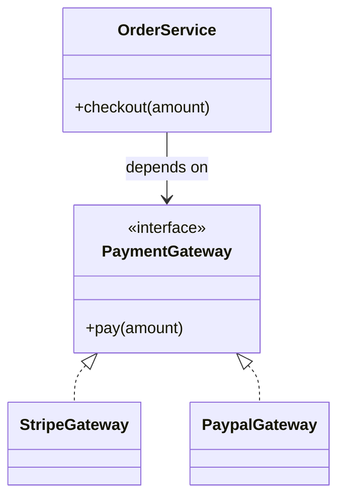

# D — Dependency Inversion Principle (DIP)

> Preview with **Cmd / Ctrl + Shift + V**
>
> **Code:** [`dip.ts`](./dip.ts) — run with `npm run demo:dip`

---

## Definition

> High-level modules should not depend on low-level modules. Both should depend on **abstractions**.  
> Abstractions should not depend on details. Details should depend on abstractions.

**One sentence:**

> `OrderService` should depend on a `PaymentGateway` interface — not on `StripeGateway` concretely.

---

## Why it matters

If a high-level policy class does `new StripeGateway()` inside itself:

- You can’t swap PayPal without editing OrderService
- Unit tests hit the real network
- The business rule layer is glued to a vendor

DIP = inject the abstraction (constructor injection is the usual JS/TS style). Same idea as Nestlé `Persistence` / Google Docs storage strategies.

---

## Example: Checkout payments

**Violation:** `OrderService` constructs `StripeGateway` directly.

**Fixed:** `PaymentGateway` interface; `StripeGateway` / `PaypalGateway` implement it; `OrderService` receives the gateway in its constructor.



**Reading the UML:** arrows point toward the abstraction. Swap Stripe ↔ PayPal without changing OrderService.

---

## Run it

```bash
npm run demo:dip
```
