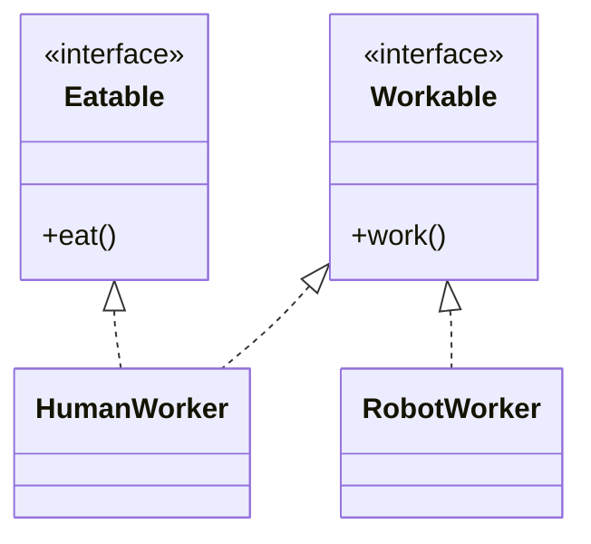

# I — Interface Segregation Principle (ISP)

> Preview with **Cmd / Ctrl + Shift + V**
>
> **Code:** [`isp.ts`](./isp.ts) — run with `npm run demo:isp`

---

## Definition

> Clients should not be forced to depend on **methods they do not use**. Prefer **small, focused interfaces** over one fat interface.

**One sentence:**

> Don’t make `Robot` implement `eat()` just because your `Worker` interface bundled work + eat together.

---

## Why it matters

Fat interfaces create empty / fake implementations (`eat() { /* no-op */ }` or throw). That is noise and a lying API. Split interfaces so each implementer only opts into what it needs.

---

## Example: Workers

**Violation:** `Worker` has `work()` and `eat()`. `RobotWorker` must implement `eat()` senselessly.

**Fixed:** `Workable` + `Eatable`. Humans implement both; robots implement only `Workable`.



**Reading the UML:** Robot only depends on `Workable`. No fake `eat()`.

---

## Run it

```bash
npm run demo:isp
```
