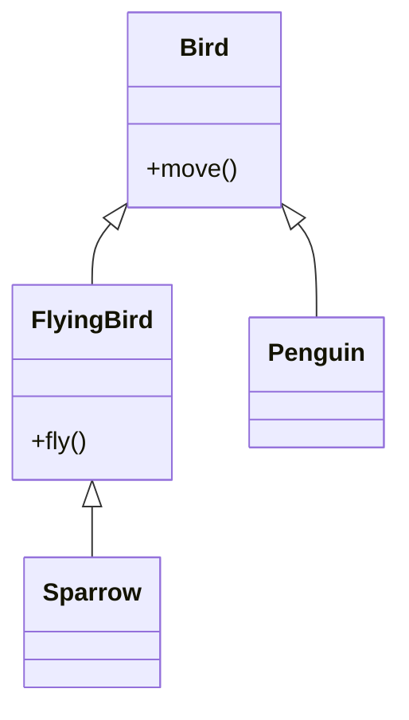

# L — Liskov Substitution Principle (LSP)

> Preview with **Cmd / Ctrl + Shift + V**
>
> **Code:** [`lsp.ts`](./lsp.ts) — run with `npm run demo:lsp`

---

## Definition

> Objects of a **superclass** should be replaceable with objects of a **subclass** without breaking the program’s correctness.

**One sentence:**

> If code works with `Bird`, it should still work when you pass `Sparrow` — a subtype must not surprise callers.

---

## Why it matters

Inheritance that “looks fine” but breaks expectations causes subtle bugs. LSP says: **honour the contract** of the base type (methods, meaning of return values, what you promise not to throw).

Classic smell: a subclass that overrides a method to throw, or ignores part of the parent API.

---

## Example: Birds and flying

**Violation:** `Bird` has `fly()`. `Penguin` extends `Bird` but `fly()` throws — any loop over `Bird[]` that calls `fly()` crashes.

**Fixed:** split capabilities — `Bird` for shared behaviour; `FlyingBird` adds `fly()`. Penguin is a Bird, not a FlyingBird.



**Reading the UML:** only flying birds expose `fly()`. Substituting Penguin where FlyingBird is required is no longer possible — which is good.

---

## Run it

```bash
npm run demo:lsp
```
