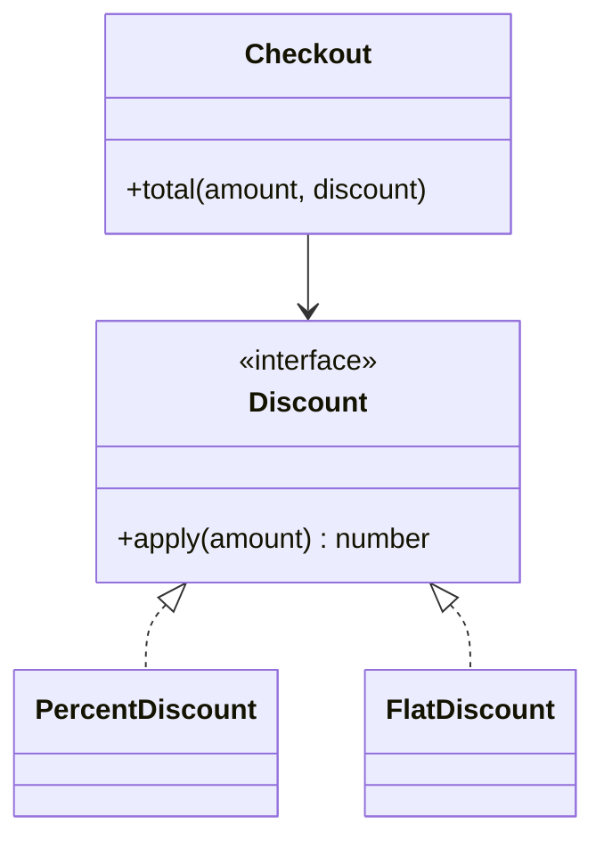

# O — Open/Closed Principle (OCP)

> Preview with **Cmd / Ctrl + Shift + V**
>
> **Code:** [`ocp.ts`](./ocp.ts) — run with `npm run demo:ocp`

---

## Definition

> Software entities should be **open for extension** but **closed for modification**.

**One sentence:**

> Add a new discount type by adding a class — not by editing a giant `if/else` in an existing class.

---

## Why it matters

Every time you open an old file to support a new case, you risk regressions. OCP pushes you toward **polymorphism / strategy**: new behaviour = new code, old code stays stable.

You already saw this with Nestlé Factory Method: new region = new factory class.

---

## Example: Discount calculator

**Violation:** `if (type === "percent") … else if (type === "flat") …` — every new discount edits this method.

**Fixed:** `Discount` interface + `PercentDiscount` / `FlatDiscount` / `BogoDiscount`. Checkout only calls `discount.apply(amount)`.



**Reading the UML:** Checkout depends on the `Discount` abstraction. New discount classes plug in without changing Checkout.

---

## Run it

```bash
npm run demo:ocp
```
