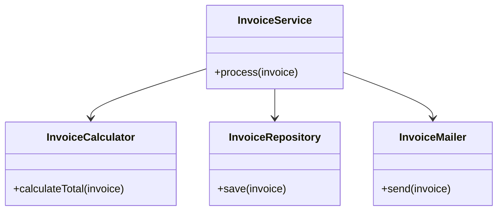

# S — Single Responsibility Principle (SRP)

> Preview with **Cmd / Ctrl + Shift + V**
>
> **Code:** [`srp.ts`](./srp.ts) — run with `npm run demo:srp`

---

## Definition

> A class should have **only one reason to change** — one job, one responsibility.

**One sentence:**

> If you change “how we email” and “how we save to DB” for different business reasons, those should not live in the same class.

---

## Why it matters

When one class owns calculation + persistence + notification:

- Every small feature risks breaking unrelated behaviour
- Tests become huge
- Code reviews can’t answer “what does this class do?” in one line

SRP fixes that by splitting roles.

---

## Example: Invoice

**Violation:** `InvoiceService` calculates total, saves to DB, _and_ sends email.

**Fixed:** `InvoiceCalculator` + `InvoiceRepository` + `InvoiceMailer`, orchestrated by a thin `InvoiceService`.



**Reading the UML:** the service coordinates; each helper has one reason to change (math, storage, or email).

---

## Run it

```bash
npm run demo:srp
```
