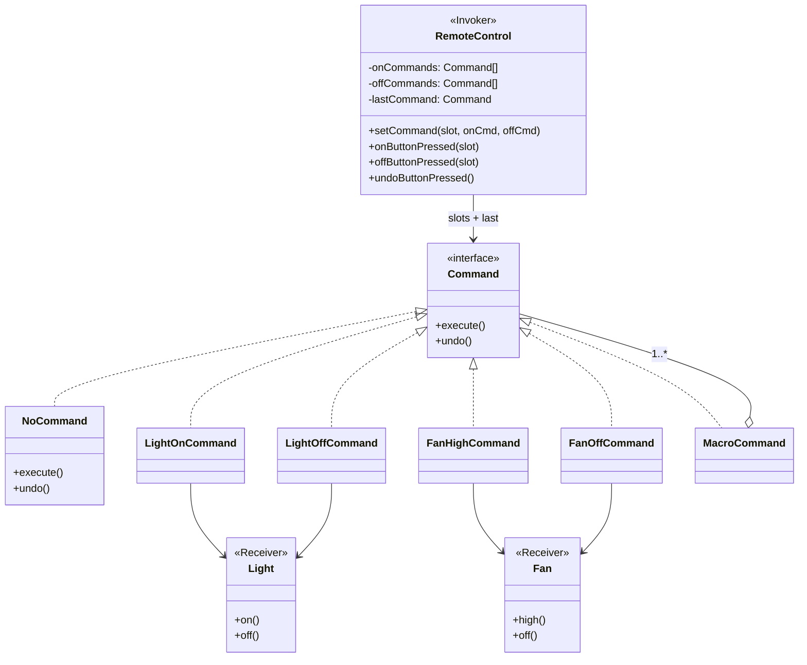

# Command — Smart Home Remote

> Preview with **Cmd / Ctrl + Shift + V**
>
> **Code:** [`command.ts`](./command.ts) — run with `npm run demo:command`

---

## Definition

> A remote should not know *how* a light turns on. It only knows it has a `Command`. `LightOnCommand` and `FanHighCommand` each call their receiver — and know how to undo.

**One sentence:**

> Same `remote.onButtonPressed(0)` — swap the command object, swap the action (and keep undo).

---

## Problem (before)

Buttons hard-code devices; undo and macros don’t fit:

```typescript
if (button === "light-on") this.light.on();
else if (button === "fan-high") this.fan.high();
// Undo? Party mode? Edit BadRemote again.
```

Add a new device → edit the remote. That’s the opposite of Open/Closed.

---

## UML



**Reading the UML:** receivers (`Light`, `Fan`) do the real work. Concrete commands bind a receiver + action. `RemoteControl` only holds `Command` slots — it never calls `light.on()` itself. `MacroCommand` is a command made of other commands.

---

## How it works

```typescript
const light = new Light();
const fan = new Fan();
const remote = new RemoteControl(3);

remote.setCommand(0, new LightOnCommand(light), new LightOffCommand(light));
remote.setCommand(1, new FanHighCommand(fan), new FanOffCommand(fan));

remote.onButtonPressed(0);  // Light ON
remote.undoButtonPressed(); // Light OFF again

// Macro = one button, many actions
const partyOn = new MacroCommand([
  new LightOnCommand(light),
  new FanHighCommand(fan),
]);
remote.setCommand(2, partyOn, /* partyOff */ ...);
remote.onButtonPressed(2);
remote.undoButtonPressed(); // undoes in reverse
```

---

## Roles cheat sheet

| Role | In this demo | Responsibility |
|------|--------------|----------------|
| **Receiver** | `Light`, `Fan` | Device APIs (`on` / `off` / `high`) |
| **Command** | `LightOnCommand`, … | Bind receiver + action; implement undo |
| **Invoker** | `RemoteControl` | Press slots; track `lastCommand` for undo |
| **Client** | demo `main` | Wire devices → commands → remote |

---

## Why undo “just works”

Each command remembers enough state to reverse itself:

| Command | `execute()` | `undo()` |
|---------|-------------|----------|
| `LightOnCommand` | `light.on()` | `light.off()` |
| `FanHighCommand` | save prev speed, then `high()` | restore prev |
| `MacroCommand` | run children forward | undo children **reverse** |

The remote only stores `lastCommand` — it doesn’t need a giant undo switch.

---

## Command vs if/else remote

| | if/else remote | Command |
|--|----------------|---------|
| New device action | Edit invoker | Add a Command class |
| Undo | Manual special cases | `lastCommand.undo()` |
| Macro “all off” | More branches | `MacroCommand([...])` |
| Testing LightOn alone | Hard | `new LightOnCommand(light).execute()` |

---

## Run it

```bash
npm run demo:command
```

You’ll see the bad remote first, then the good remote with light / fan / party macro and undo.
