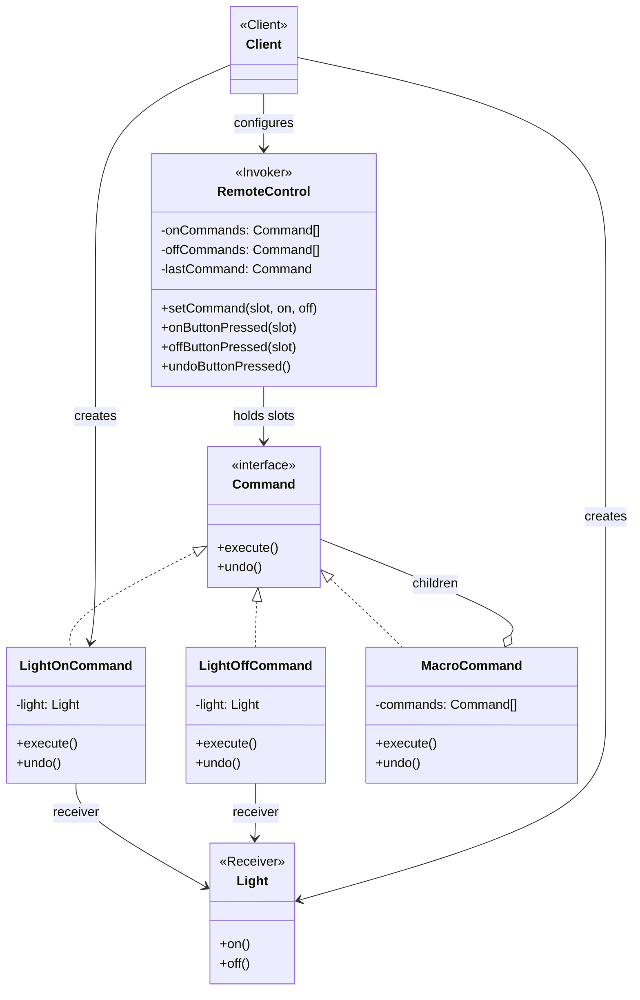

# Command Pattern — Understanding the Idea

> Preview with **Cmd / Ctrl + Shift + V**

---

## Definition

> **Command** is a behavioral design pattern that turns a **request into a standalone object**. That object holds everything needed to run the action later — so you can queue it, log it, undo it, or compose it into macros.

In plain words:

> *"Don’t call `light.on()` from the button. Wrap ‘turn light on’ as an object the remote can execute — and undo."*

---

## What problem does it solve?

Without Command, the invoker (remote / UI / API handler) hard-codes receivers:

```typescript
class BadRemote {
  press(button: string) {
    if (button === "light-on") this.light.on();
    else if (button === "fan-high") this.fan.high();
    // undo? queue? "all off" macro? edit this class again
  }
}
```

Problems:

1. **Tight coupling** — remote knows every device API
2. **No undo / history** — you didn’t capture “what just ran”
3. **No macros** — “party mode” means another if-branch
4. **Hard to extend** — new device = edit the invoker (OCP dies)

Command flips it: each request is an object with `execute()` / `undo()`. The remote only presses slots.

---

## Standard UML



**Reading the UML:**

| Role | Who | Job |
|------|-----|-----|
| **Command** | interface | `execute()` / `undo()` |
| **ConcreteCommand** | `LightOnCommand`, … | Binds a receiver + action |
| **Receiver** | `Light`, `Fan` | Does the real work |
| **Invoker** | `RemoteControl` | Runs commands; never calls receivers directly |
| **Client** | demo / app setup | Wires receivers → commands → slots |

---

## Core flow

```
Client wires: slot 0 = LightOn / LightOff
        │
User presses ON on slot 0
        │
        ▼
RemoteControl.onButtonPressed(0)
        │
        ▼
LightOnCommand.execute()  →  Light.on()
        │
        ▼
Remote remembers lastCommand
        │
User presses Undo
        │
        ▼
lastCommand.undo()  →  Light.off()
```

---

## Command vs Strategy (interview trap)

| | Strategy | Command |
|--|----------|---------|
| Goal | Swap *how* a job is done | Encapsulate a *request* as an object |
| Typical methods | `pay(amount)` | `execute()` / `undo()` |
| History / undo | Rarely | Core selling point |
| Example | Card vs UPI checkout | Remote button → LightOnCommand |

Both use an interface + interchangeable classes. Ask: **“Do I need undo, queue, or macros?”** → Command. **“Do I need interchangeable algorithms for the same operation?”** → Strategy.

---

## When to use Command

| Use it when… | Skip it when… |
|--------------|---------------|
| You need undo / redo | A direct method call is enough |
| Requests must be queued, logged, or delayed | No history, no macros |
| UI / remote shouldn’t know receivers | One caller, one receiver forever |
| Macros (“all off”) matter | Simple one-shot actions |

Real-world cousins: text-editor undo stacks, job queues, Redux-style actions, transaction scripts, smart-home scenes.

---

## SOLID connection

| Principle | How Command helps |
|-----------|-------------------|
| **S** | Remote invokes; commands bind; receivers do work |
| **O** | New device action = new Command class; remote stays closed |
| **D** | Invoker depends on `Command`, not `Light` / `Fan` |

---

## Lesson in this folder

| Resource | What |
|----------|------|
| [command.md](./command.md) | Smart Home Remote walkthrough |
| [command.ts](./command.ts) | Bad if/else remote vs Command + undo + macro |

```bash
npm run demo:command
```

---

## Interview one-liner

> *"Command wraps a request as an object with execute/undo — so invokers can queue, undo, and macro without knowing receivers."*
