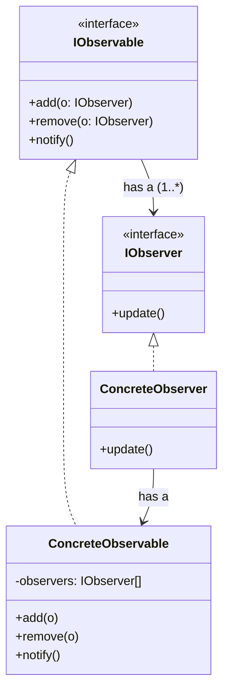

# Observer Pattern — Understanding the Idea

> Preview with **Cmd / Ctrl + Shift + V**

---

## Definition

> **Observer** is a behavioral design pattern where an object (the **Observable / Subject**) maintains a list of dependents (**Observers**) and **notifies** them automatically when its state changes.

In plain words:

> _"When something important changes, tell everyone who subscribed — don’t make them poll forever."_

Also known as: **Publish–Subscribe** (same idea; wording differs by context).

---

## The problem it solves

Without Observer, the subject hard-codes who to update:

```typescript
class WeatherStation {
  setTemperature(t: number) {
    this.temp = t;
    phoneDisplay.show(t); // tightly coupled
    tvDisplay.show(t); // tightly coupled
    // add a new display? edit this class again
  }
}
```

Problems:

1. **Tight coupling** — station knows every display class
2. **Hard to extend** — new subscriber means editing the subject
3. **Wrong responsibility** — subject should change state, not manage every UI

Observer flips it: displays **subscribe**; station only calls `notify()`.

---



**Reading the UML:** `IObservable` is the subject contract (`add` / `remove` / `notify`). `IObserver` is the subscriber contract (`update`). Concrete classes implement those interfaces. The subject **has many** observers; in the classic (pull) form the observer also **has a** reference back to the subject so it can ask for state after `update()` is called.

---

## Core flow

```
1. Observer calls observable.add(this)     → subscribe
2. Observable state changes
3. Observable calls notify()
4. notify() loops observers and calls update()
5. Each observer reacts (refresh UI, log, alert, …)
```

---

## Two ways to deliver data: Pull vs Push

After `notify()`, how does the observer get the new values?

| Style    | How data moves                                                        | `update` shape | Observer needs subject reference?              |
| -------- | --------------------------------------------------------------------- | -------------- | ---------------------------------------------- |
| **Pull** | Subject says “something changed”; observer **asks** for what it needs | `update()`     | Usually **yes** — call `getTemperature()` etc. |
| **Push** | Subject **sends** the data in the notification                        | `update(data)` | Usually **no** — data already arrived          |

Same Nestlé-style teaching example for both: a **Weather Station** with phone + TV displays.

| Folder                          | Lesson                                          |
| ------------------------------- | ----------------------------------------------- |
| [pull/](./pull/pullObserver.md) | Classic UML — displays pull from the station    |
| [push/](./push/pushObserver.md) | Station pushes weather data into `update(data)` |

```bash
npm run demo:observer-pull
npm run demo:observer-push
npm run demo:observer
```

---

## When to use Observer

| Use it when…                                      | Skip it when…                                              |
| ------------------------------------------------- | ---------------------------------------------------------- |
| Many objects must react to one object’s changes   | Only one dependent and it will never grow                  |
| You want loose coupling (subscribe / unsubscribe) | You need guaranteed sync transactions across all listeners |
| Events, UI updates, stock ticks, notifications    | Order of notification must be complex / transactional      |

Real-world cousins in JS: DOM events, Node `EventEmitter`, RxJS Observables, Redux subscribers.

---

## SOLID highlights

| Principle | How Observer helps                                                 |
| --------- | ------------------------------------------------------------------ |
| **S**     | Subject manages state + subscriber list; observers only react      |
| **O**     | New display = new observer class; station stays closed             |
| **D**     | Both sides depend on `IObservable` / `IObserver`, not concrete UIs |

---

## Interview one-liner

> _"Observer: subject keeps a list of subscribers and notifies them on change. Pull = observer fetches state; Push = subject sends data in update()."_
