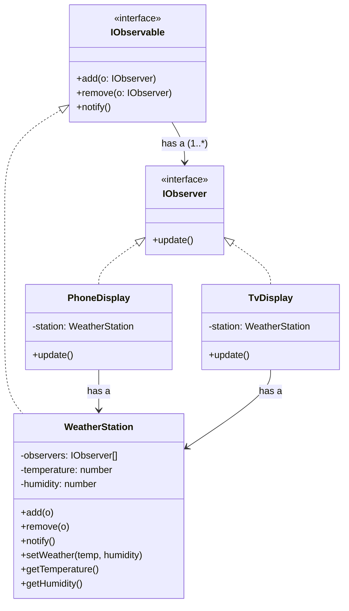

# Observer — Pull Model (Weather Station)

> Preview with **Cmd / Ctrl + Shift + V**
>
> **Code:** [`pullObserver.ts`](./pullObserver.ts) — run with `npm run demo:observer-pull`

---

## Definition

> In the **pull** model, the Observable only announces *“state changed”*. Each Observer then **pulls** (queries) whatever data it needs from the subject.

This matches the **standard UML**: `update()` takes no data, and the ConcreteObserver **has a** reference to the ConcreteObservable.

**One sentence:**

> Station says “updated!” → PhoneDisplay calls `station.getTemperature()` itself.

---

## Why pull?

| Good for | Why |
|----------|-----|
| Observers need **different** slices of state | Phone wants temp only; Logger wants temp + humidity |
| Large state objects | Avoid shoving a huge payload into every `update` |
| Classic textbook / interview UML | Matches the diagram with the back-reference |

Trade-off: observers are a bit more coupled to the subject’s getters.

---

## UML



**Reading the UML:** WeatherStation implements `IObservable` and stores many observers. PhoneDisplay / TvDisplay implement `IObserver` and each keep a reference to the station. On `update()`, they pull `getTemperature()` / `getHumidity()` — that back-arrow is the pull model.

---

## How it works

```
setWeather(32, 70)
      → notify()
            → phone.update()  → phone pulls getTemperature()
            → tv.update()     → tv pulls getTemperature() + getHumidity()
```

```typescript
station.add(phone);
station.add(tv);
station.setWeather(32, 70); // both displays refresh by pulling
```

---

## Pull vs Push (quick)

| | Pull (this lesson) | Push |
|--|--------------------|------|
| `update` | `update()` | `update(data)` |
| Who fetches data? | Observer | Subject sends it |
| Has-a back to subject? | Yes | Optional |

Next: [Push model](../push/pushObserver.md).

---

## Run it

```bash
npm run demo:observer-pull
```
