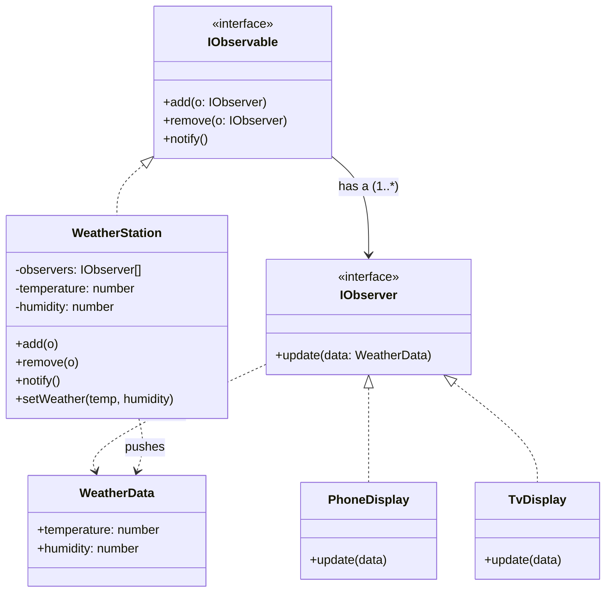

# Observer — Push Model (Weather Station)

> Preview with **Cmd / Ctrl + Shift + V**
>
> **Code:** [`pushObserver.ts`](./pushObserver.ts) — run with `npm run demo:observer-push`

---

## Definition

> In the **push** model, the Observable **sends the new state** (or a data package) into `update(data)`. Observers react immediately — they do not need to call getters on the subject.

**One sentence:**

> Station says “updated — here’s `{ temp, humidity }`” → displays use that payload.

---

## Why push?

| Good for | Why |
|----------|-----|
| Same small payload for every listener | Temp + humidity fit in one object |
| Observers should stay **decoupled** from subject getters | No back-reference required for data |
| Event-style APIs | Feels like DOM / EventEmitter (`emit("change", data)`) |

Trade-off: every observer receives the same package — even if it only needs one field. For huge state, pull (or selective push) can be cleaner.

---

## UML



**Reading the UML:** Same subscribe/notify skeleton as pull, but `update(data: WeatherData)` carries the payload. PhoneDisplay / TvDisplay do **not** need a “has a WeatherStation” arrow for reading state — the data was pushed in.

---

## How it works

```
setWeather(32, 70)
      → notify() builds WeatherData
            → phone.update({ temperature: 32, humidity: 70 })
            → tv.update({ temperature: 32, humidity: 70 })
```

```typescript
station.add(phone);
station.add(tv);
station.setWeather(32, 70); // both get the pushed WeatherData
```

---

## Push vs Pull (quick)

| | Push (this lesson) | Pull |
|--|--------------------|------|
| `update` | `update(data)` | `update()` |
| Who sends data? | Subject | Observer fetches |
| Coupling to getters | Low | Higher |

Back to: [Pull model](../pull/pullObserver.md) · Overview: [pattern_understanding.md](../pattern_understanding.md)

---

## Run it

```bash
npm run demo:observer-push
```
