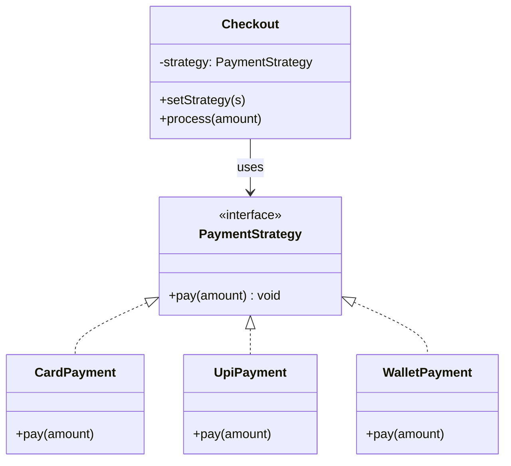

# Strategy Pattern — Understanding the Idea

> Preview with **Cmd / Ctrl + Shift + V**

---

## Definition

> **Strategy** is a behavioral design pattern that lets you define a **family of algorithms**, put each in its own class, and make them **interchangeable**. The client picks a strategy at runtime without changing the code that uses it.

In plain words:

> *"Don’t bury payment logic in a giant if/else. Plug in Card, UPI, or Wallet — same checkout flow."*

---

## What problem does it solve?

Without Strategy, behaviour forks live inside one method:

```typescript
function checkout(amount: number, method: string) {
  if (method === "card") {
    // validate card… charge card… receipt…
  } else if (method === "upi") {
    // validate UPI… charge UPI… receipt…
  } else if (method === "wallet") {
    // validate wallet… charge wallet… receipt…
  }
}
```

Problems:

1. **DRY dies** — the same `if/else` tree gets copied into `refund()`, `validate()`, admin tools…
2. **OCP dies** — new method (PayPal) means editing every switch
3. **Hard to test** — can’t unit-test “UPI charge” without dragging the whole checkout
4. **Unreadable** — one function knows every payment world’s details

Strategy extracts each algorithm into its own class. Checkout only calls `strategy.pay(amount)`.

---

## How it helps with DRY

| Without Strategy | With Strategy |
|------------------|---------------|
| Card / UPI / Wallet logic repeated in pay + refund + validate | Each method class owns its logic once |
| Copy-paste a new `else if` in 3 places | Add `PaypalStrategy` once; inject where needed |
| Changing UPI rules risks breaking card code | Change only `UpiPayment` |

**DRY win:** the *algorithm* lives in one place. The *context* (Checkout) is written once and reused with any strategy.

---

## Standard UML



**Reading the UML:** `PaymentStrategy` is the shared contract. Card / UPI / Wallet each implement `pay()`. `Checkout` (the **context**) holds a strategy and delegates — it does not know which concrete class is plugged in. Swap the strategy → same checkout, different algorithm.

---

## Core flow

```
checkout.setStrategy(new UpiPayment("user@ok"))
checkout.process(499)
        │
        ▼
  strategy.pay(499)   // UpiPayment’s algorithm runs
```

---

## When to use Strategy

| Use it when… | Skip it when… |
|--------------|---------------|
| Many ways to do the same job (pay, sort, compress, route) | Only one algorithm forever |
| You keep copying the same if/else | A simple ternary is enough |
| Algorithms should be swappable at runtime | Behaviour never changes |

Real-world cousins: sorting comparators, Express middleware choices, discount engines (see your OCP lesson — same idea), React “render props” / injectable behaviours.

---

## SOLID connection

| Principle | How Strategy helps |
|-----------|--------------------|
| **O** | New payment = new class; Checkout stays closed |
| **S** | Checkout orchestrates; each strategy only pays |
| **D** | Checkout depends on `PaymentStrategy`, not Card/UPI |

---

## Lesson in this folder

| Resource | What |
|----------|------|
| [strategy.md](./strategy.md) | Payment checkout walkthrough |
| [strategy.ts](./strategy.ts) | Bad if/else vs Strategy (DRY) |

```bash
npm run demo:strategy
```

---

## Interview one-liner

> *"Strategy replaces if/else algorithms with interchangeable classes behind one interface — keeps DRY and Open/Closed."*
