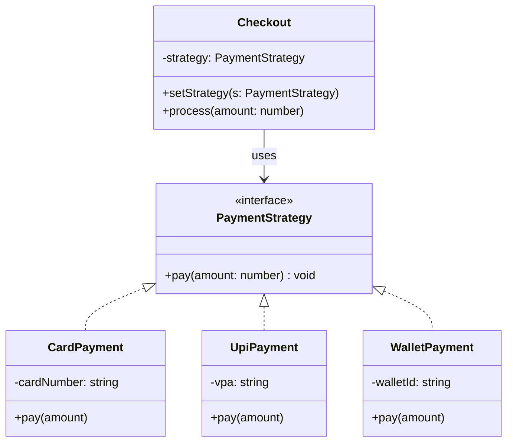

# Strategy — Payment Checkout

> Preview with **Cmd / Ctrl + Shift + V**
>
> **Code:** [`strategy.ts`](./strategy.ts) — run with `npm run demo:strategy`

---

## Definition

> Checkout should not know *how* money is collected. It only knows it has a `PaymentStrategy`. Card, UPI, and Wallet each implement `pay(amount)` their own way.

**One sentence:**

> Same `checkout.process(499)` — swap the strategy, swap the algorithm.

---

## DRY problem (before)

Imagine pay **and** refund both need the same branching:

```typescript
// duplicated in pay() AND refund() AND validate()
if (method === "card") { /* card rules */ }
else if (method === "upi") { /* upi rules */ }
else if (method === "wallet") { /* wallet rules */ }
```

Add PayPal → edit **every** copy. That’s the opposite of DRY.

---

## UML



**Reading the UML:** three concrete strategies implement one interface. `Checkout` only depends on `PaymentStrategy` (arrow to the interface). Client code sets which strategy to use, then calls `process()` — no if/else inside Checkout.

---

## How it works

```typescript
const checkout = new Checkout(new CardPayment("4111-****"));
checkout.process(499);

checkout.setStrategy(new UpiPayment("learner@okaxi"));
checkout.process(199); // same Checkout, different algorithm
```

---

## Strategy vs if/else (DRY)

| | if/else | Strategy |
|--|---------|----------|
| New payment method | Edit existing method(s) | Add a class |
| Same branching in pay + refund | Copy-paste | Reuse strategy classes |
| Testing UPI alone | Hard | `new UpiPayment(...).pay(100)` |

---

## Run it

```bash
npm run demo:strategy
```
