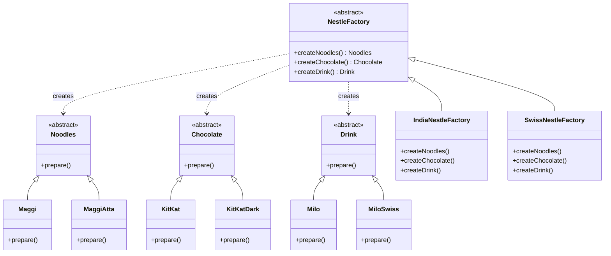

# Abstract Factory — Nestlé Combo Pack

> Preview with **Cmd / Ctrl + Shift + V**
>
> **Code:** [`abstractFactory.ts`](./abstractFactory.ts) — run with `npm run demo:abstract-factory`

---

## Definition

> **Abstract Factory** is a creational pattern that provides an **interface for creating a family of related products**, without naming their concrete classes.

**One sentence:**

> One factory gives you a **whole Nestlé combo** (noodles + chocolate + drink) that all belong to the same region — India or Swiss — without the client writing `new Maggi()` / `new KitKat()` / `new Milo()`.

---

## How is this different from Factory Method?

| | Factory Method | Abstract Factory |
|--|----------------|------------------|
| Focus | Create **one** product (subclass picks which) | Create a **family** of related products |
| Factory API | Usually `createProduct(type)` | Several methods: `createNoodles()`, `createChocolate()`, `createDrink()` |
| Nestlé story | Order `"maggi"` from India or Swiss plant | Get a full **combo pack** from India or Swiss plant |
| Guarantee | Correct single product | Products in the pack **match** (no India Maggi + Swiss KitKat by mistake) |

Factory Method = one item from a regional plant.  
Abstract Factory = **the whole shelf** from that plant, kept consistent.

---

## Our example: Nestlé regional combo

Every region sells three related snacks:

| Slot | Abstract product | India | Swiss |
|------|------------------|-------|-------|
| Noodles | `Noodles` | `Maggi` | `MaggiAtta` |
| Chocolate | `Chocolate` | `KitKat` | `KitKatDark` |
| Drink | `Drink` | `Milo` | `MiloSwiss` |



**Reading the UML:** Instead of one product type, there are three abstract slots — `Noodles`, `Chocolate`, `Drink` — each with India and Swiss concretes. Abstract `NestleFactory` exposes three create methods (no type string); `IndiaNestleFactory` and `SwissNestleFactory` inherit and fill the whole combo. Dashed `creates` arrows mean the factory builds that family. Swap the factory instance and Maggi+KitKat+Milo become MaggiAtta+KitKatDark+MiloSwiss together.

---

## How it works

```typescript
function serveCombo(factory: NestleFactory): void {
  const noodles = factory.createNoodles();
  const chocolate = factory.createChocolate();
  const drink = factory.createDrink();

  noodles.prepare();
  chocolate.prepare();
  drink.prepare();
}

serveCombo(new IndiaNestleFactory()); // Maggi + KitKat + Milo
serveCombo(new SwissNestleFactory()); // MaggiAtta + KitKatDark + MiloSwiss
```

Client depends only on `NestleFactory` and the three abstract products.

---

## Pros & cons

| Pros | Cons |
|------|------|
| Keeps product families **consistent** | Adding a new product *slot* means updating every concrete factory |
| Easy to swap an entire theme/region | More classes than Simple Factory |
| Strong OCP for new **families** (add Japan factory) | Overkill if you only create one product type |

---

## SOLID check

| Principle | Fit? |
|-----------|------|
| **S** | Each product prepares; factory only creates the family |
| **O** | New region = new factory class; client unchanged |
| **L** | Any `NestleFactory` works in `serveCombo` |
| **D** | Client depends on abstractions, not Maggi / KitKatDark |

---

## The Nestlé factory ladder (recap)

```
Simple Factory   → one plant, createProduct("maggi")
Factory Method   → India/Swiss plant, createProduct("maggi") → different Maggi
Abstract Factory → India/Swiss plant, createNoodles + createChocolate + createDrink
```

---

## Run it

```bash
npm run demo:abstract-factory
```
