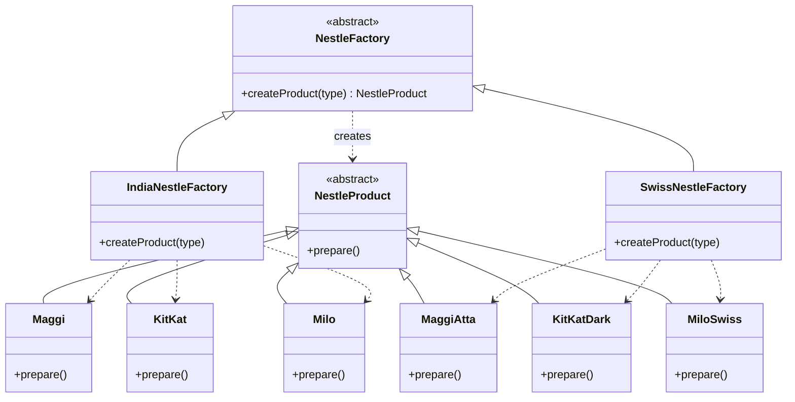

# Factory Method — Nestlé Regional Plants

> Preview with **Cmd / Ctrl + Shift + V**
>
> **Code:** [`factoryMethod.ts`](./factoryMethod.ts) — run with `npm run demo:factory-method`

---

## Definition

> **Factory Method** is a creational design pattern that defines an **abstract method for creating a product**, and lets **subclasses decide which concrete product** to return.

**One sentence:**

> The abstract factory says _“create a product”_. India vs Swiss factories each override that method and return their own Nestlé line.

This is the GoF pattern. Simple Factory is one class with a switch. Factory Method is a **hierarchy of creators**.

---

## Why not just Simple Factory?

With Simple Factory, one `NestleFactory` grows forever:

```typescript
// becomes painful when India and Swiss need DIFFERENT Maggi / KitKat variants
if (region === "india" && type === "maggi") return new MaggiIndia();
if (region === "swiss" && type === "maggi") return new MaggiAtta();
// ... explosion of if/else
```

Factory Method says: **give each region its own factory subclass**. Add Swiss? Add `SwissNestleFactory`. Old factories stay closed (Open/Closed).

---

## Class diagram (Nestlé)



**Reading the UML:** On the product side, Maggi / KitKat / Milo (India) and MaggiAtta / KitKatDark / MiloSwiss (Swiss) all inherit from abstract `NestleProduct`. On the creator side, abstract `NestleFactory` declares `createProduct(type)`, and `IndiaNestleFactory` / `SwissNestleFactory` inherit and override it — dashed arrows show which plant builds which snacks. Same order `"maggi"`: India returns Maggi, Swiss returns MaggiAtta. That creator inheritance is what Simple Factory does not have.

---

## How it works

```typescript
function serveOrder(factory: NestleFactory, type: ProductType) {
  const product = factory.createProduct(type); // subclass decides WHICH class
  product.prepare();
}

serveOrder(new IndiaNestleFactory(), "maggi"); // Maggi (India style)
serveOrder(new SwissNestleFactory(), "maggi"); // MaggiAtta (Swiss line)
```

Client code talks only to `NestleFactory` and `NestleProduct` — never `new Maggi()` or `new MaggiAtta()` directly.

---

## Simple Factory vs Factory Method

|           | Simple Factory             | Factory Method                     |
| --------- | -------------------------- | ---------------------------------- |
| Creators  | **One** concrete factory   | **Abstract** factory + subclasses  |
| Extension | Edit the switch            | Add a new factory class            |
| Best for  | Small, single product line | Multiple brands / regions / styles |
| OCP       | Weaker                     | Stronger                           |

---

## SOLID highlights

| Principle | How Factory Method helps                                |
| --------- | ------------------------------------------------------- |
| **S**     | Products prepare; factories create                      |
| **O**     | New region = new factory class, old code untouched      |
| **L**     | Any `NestleFactory` can be passed to client code        |
| **D**     | Client depends on abstractions, not Maggi / Swiss types |

---

## Run it

```bash
npm run demo:factory-method
```
