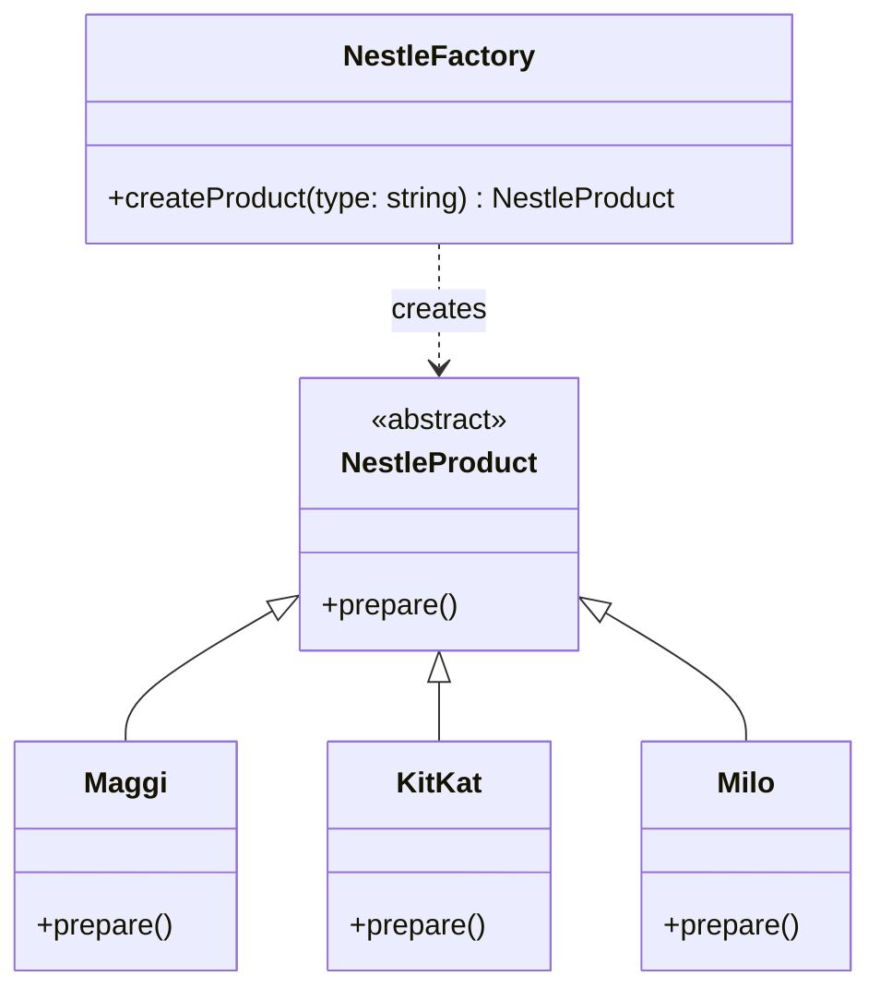

# Simple Factory — Nestlé Products

> Preview with **Cmd / Ctrl + Shift + V**
>
> **Code:** [`simpleFactory.ts`](./simpleFactory.ts) — run with `npm run demo:simple-factory`

---

## Definition

> **Simple Factory** is a creational pattern where **one factory class** decides which concrete product to create based on an input (usually a type string or enum).

It is the simplest form of "factory". Technically it is often called a **programming idiom** rather than a GoF pattern — but interviews love it, and it is the perfect first step before Factory Method.

**One sentence:**

> Client says `"maggi"` → `NestleFactory` returns a `Maggi` object. Client never writes `new Maggi()`.

---

## Our example: Nestlé snack factory

Imagine one Nestlé plant that can make Maggi, KitKat, or Milo. The shop counter does not care _how_ each is prepared — it only asks the factory for a product and calls `prepare()`.



**Reading the UML:** `NestleProduct` is the shared abstract type; Maggi, KitKat, and Milo inherit from it (`<|--`). `NestleFactory` is a single concrete creator with `createProduct(type)` — the dashed `creates` arrow means it builds products. The client talks only to the factory and the abstract product, never `new Maggi()` directly.

---

## How it works

| Step | What happens                                                  |
| ---- | ------------------------------------------------------------- |
| 1    | Client calls `factory.createProduct("maggi")`                 |
| 2    | Factory looks at the type and does `new Maggi()`              |
| 3    | Client receives a `NestleProduct` (abstract type)             |
| 4    | Client calls `product.prepare()` — polymorphism does the rest |

```typescript
const factory = new NestleFactory();
const snack = factory.createProduct("kitkat"); // NestleProduct
snack.prepare(); // KitKat's own prepare()
```

---

## Pros & cons

| Pros                                                | Cons                                                                 |
| --------------------------------------------------- | -------------------------------------------------------------------- |
| Creation logic lives in **one place**               | Adding a new product means **editing** the factory (`if/else` grows) |
| Client depends on `NestleProduct`, not Maggi/KitKat | One factory can become a **god switch**                              |
| Easy to teach and use                               | Not as open for extension as Factory Method                          |

---

## SOLID check

| Principle | Fit?                                               |
| --------- | -------------------------------------------------- |
| **S**     | Products only prepare; factory only creates — good |
| **O**     | Weak — new product = modify factory                |
| **D**     | Client depends on abstract `NestleProduct` — good  |

Simple Factory is a great start. When you need **India vs Swiss lines** without editing one giant factory → go to [Factory Method](../FactoryMethod/factoryMethod.md).

---

## Run it

```bash
npm run demo:simple-factory
```
