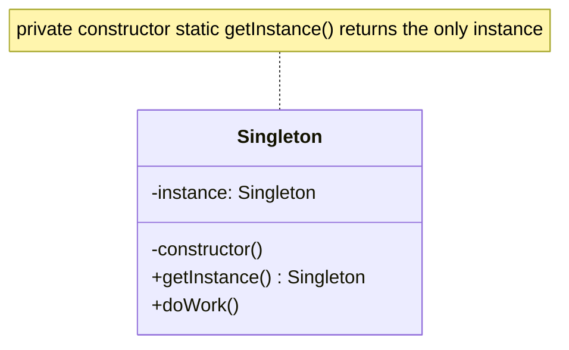

# Singleton Pattern — Understanding the Idea

> Preview with **Cmd / Ctrl + Shift + V**

---

## Definition

> **Singleton** is a creational design pattern that guarantees a class has **only one instance**, and provides a **global access point** to that instance.

Trust me, this is the most important pattern you will see and definitely see in production code.

In plain words:

> _"Create it once. Everywhere in the app talks to that same object."_

---

## The problem it solves

Some things must be shared app-wide:

- One HTTP client with shared auth / refresh state
- One logger writing to one stream
- One config / connection pool

If every screen does `new HttpClient()`, you get:

1. **Multiple axios instances** — duplicate interceptors, wasted setup
2. **Broken shared state** — token refresh queues that don’t know about each other
3. **Inconsistent behaviour** — one client refreshed the token; another still 401s

Singleton keeps **one** object owning that shared state.

---

## Classic UML



**Reading the UML:** constructor is private (or discouraged). Callers use `getInstance()` so they always receive the same object.

---

## Two common styles in TypeScript / JavaScript

It can be implemented in two ways and we will study those two ways.

| Style                | How                                            | Where you see it                 |
| -------------------- | ---------------------------------------------- | -------------------------------- |
| **Classic class**    | `private` constructor + `static getInstance()` | Interview whiteboard, Java ports |
| **Module singleton** | `export const httpClient = new HttpClient()`   | Real React / RN / Node apps      |

ES modules are evaluated **once**. Exporting one instance _is_ a Singleton — often cleaner than `getInstance()` boilerplate.

---

## Lessons in this folder

| Resource                                                                                                    | What                                             |
| ----------------------------------------------------------------------------------------------------------- | ------------------------------------------------ |
| [singleton.md](./singleton.md) + [singleton.ts](./singleton.ts)                                             | Classic Logger with `getInstance()`              |
| [productionHttpClient.md](./productionHttpClient.md) + [productionHttpClient.ts](./productionHttpClient.ts) | Production-style module singleton (`HttpClient`) |

```bash
npm run demo:singleton
npm run demo:singleton-http
```

---

## When to use / when to avoid

| Use Singleton when…                                        | Be careful when…                          |
| ---------------------------------------------------------- | ----------------------------------------- |
| Exactly one shared resource is required                    | You need easy unit tests with fresh mocks |
| Shared mutable state must stay consistent (refresh queues) | Hidden globals make dependencies unclear  |
| Setup is expensive (DB pool, SDK client)                   | You overuse it and create “god globals”   |

**Interview tip:** Prefer Singleton for _infrastructure_ (logger, http, config), not for every domain object.

---

## Interview one-liner

> _"Singleton = one instance + global access. In JS/TS we often use a module export; class getInstance is the textbook form. HttpClient with shared token-refresh state is a real production case."_
