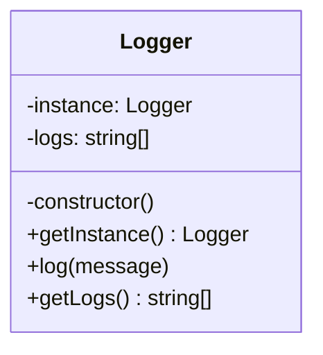

# Singleton — Classic Example (Logger)

> Preview with **Cmd / Ctrl + Shift + V**
>
> **Code:** [`singleton.ts`](./singleton.ts) — run with `npm run demo:singleton`

---

## Definition

> Ensure only **one** `Logger` exists. Every call to `Logger.getInstance()` returns the same object — so all logs share one history / one sink.

**One sentence:**

> First call creates the logger; every later call reuses it.

---

## UML



**Reading the UML:** private constructor blocks `new Logger()` from outside. `getInstance()` lazily creates and then always returns the same `instance`.

---

## How it works

```typescript
const a = Logger.getInstance();
const b = Logger.getInstance();
console.log(a === b); // true — same object in memory
```

Without Singleton, `new Logger()` twice means two separate log lists — screens wouldn’t share history.

---

## Next: production

In real apps we rarely write `getInstance()`. We export one module instance — see [productionHttpClient.md](./productionHttpClient.md).

---

## Run it

```bash
npm run demo:singleton
```
