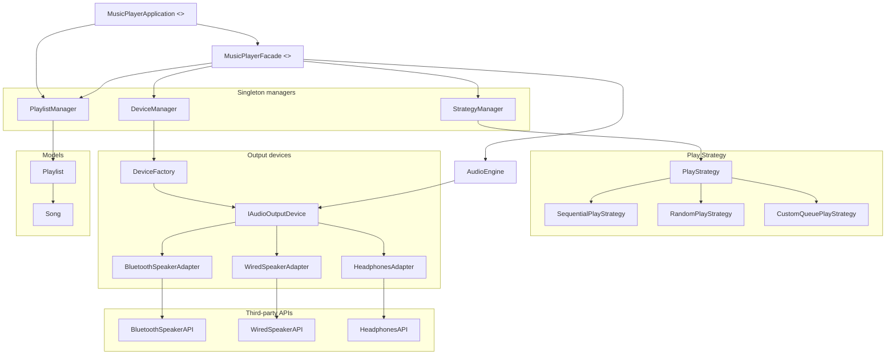
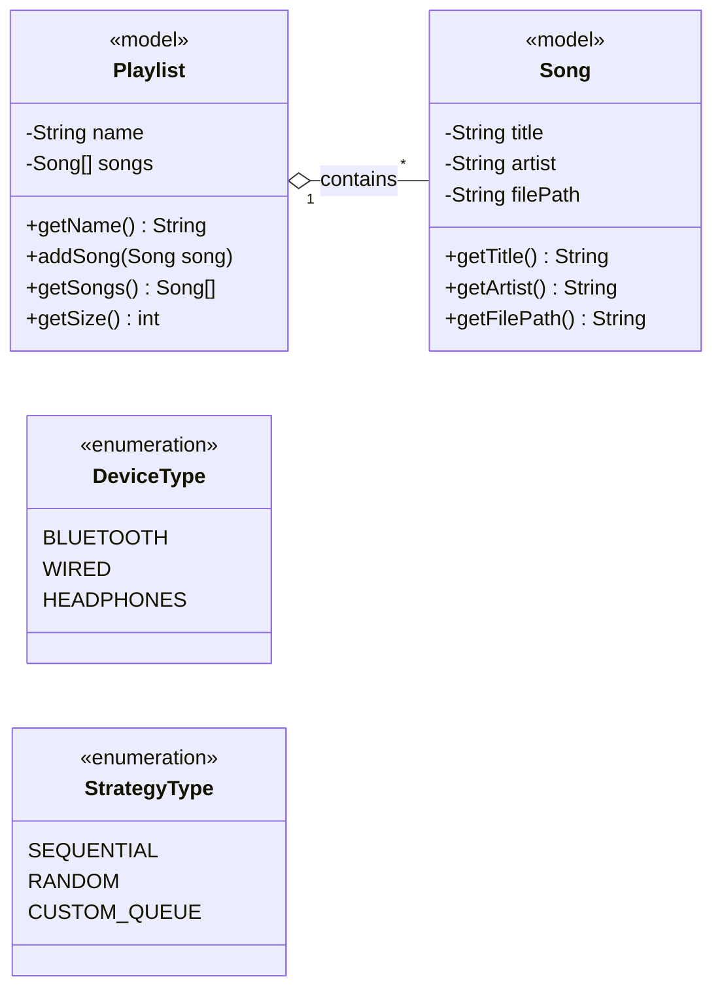
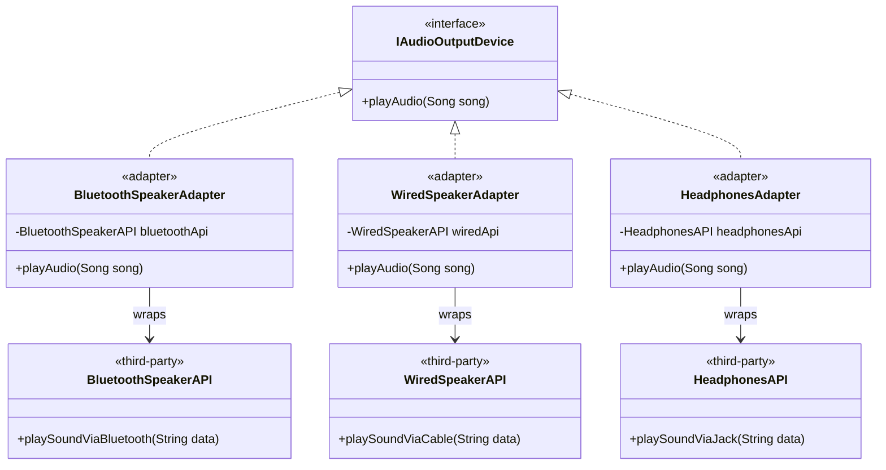
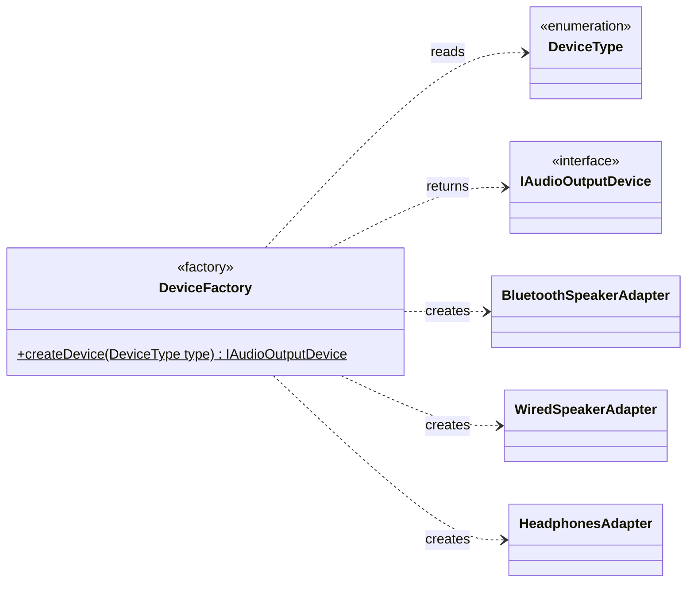
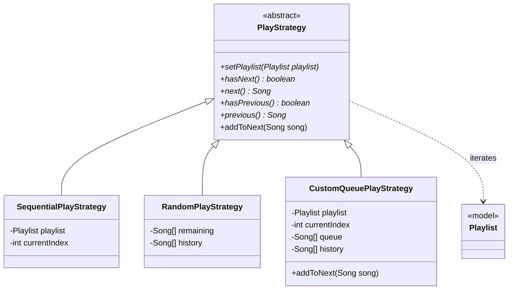
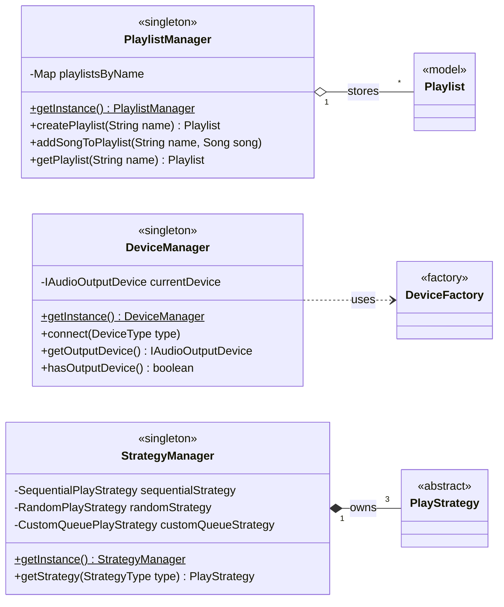
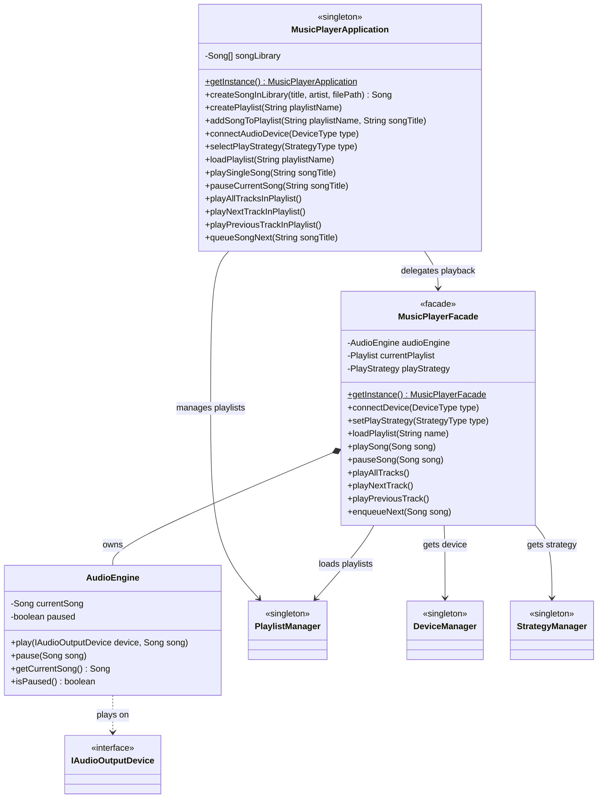
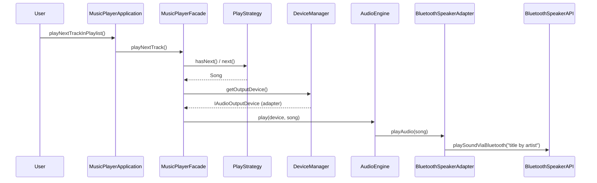

# Music Player App — Design (Bottom-up)

Preview this markdown with **Cmd/Ctrl + Shift + V**.

This case study designs a music player that plays songs and playlists in different orders and sends audio to different output devices. It is built **bottom-up**: the smallest pieces first, then the classes that combine them, and finally the single entry point a user talks to.

> **Code:** this folder — run with `npm run demo:music-player`
>
> **Requirements:** [`problem_statement.md`](./problem_statement.md)

Five patterns appear in this design: **Singleton**, **Factory**, **Strategy**, **Adapter**, and **Facade**. Each one solves a specific problem in the requirements, and this doc explains which problem and where.

The app does **not** implement Bluetooth or speaker audio. Every device ships with a third-party API, and the app only calls it.

---

## How to read this design

Each layer only depends on the layers below it:

1. **Enums + models** — What data exists? (`Song`, `Playlist`, `DeviceType`, `StrategyType`)
2. **Third-party APIs + adapters** — How does the app talk to devices it doesn't own?
3. **Factory** — Who builds the right adapter for a device type?
4. **Strategies** — Who decides which song plays next?
5. **Managers** — Who holds the shared playlists, current device, and strategy objects?
6. **AudioEngine** — Who actually plays a song on a device?
7. **Facade + Application** — How does a user drive all of this with simple calls?

The folders follow the same order, so you can read the code layer by layer.

---

## Class Diagrams

> The full design is too large for one readable diagram, so it is split into an overview and one diagram per layer.

### Overview (names only — big picture)



`MusicPlayerApplication` is the only class a user touches. It hands playback to `MusicPlayerFacade`, which coordinates the managers and the engine. At the bottom, adapters connect the app to third-party device APIs, and strategies decide play order. The next diagrams zoom into each part.

---

### 1. Enums and models



These classes hold data and nothing else.

- A **Song** is a title, an artist, and a file path.
- A **Playlist** is a name plus an ordered list of songs.
- **DeviceType** and **StrategyType** name the choices a user can make.

Notice that `Playlist` does not know how it will be played. Sequential, random, or queued order is decided elsewhere, which is what lets one playlist be played in any mode.

---

### 2. Third-party APIs and adapters (Adapter pattern)



The three device APIs come from different vendors. Each has its own method name (`playSoundViaBluetooth`, `playSoundViaCable`, `playSoundViaJack`) and expects a plain string, while our app works with `Song` objects.

The app defines one interface, **IAudioOutputDevice**, with one method: `playAudio(song)`. Each adapter implements it, turns the `Song` into the string its vendor expects, and calls the vendor's method. The rest of the app never sees a vendor API.

---

### 3. Device Factory



Creating a device takes two objects: the vendor API and the adapter that wraps it. **DeviceFactory** takes a `DeviceType` and returns a ready-to-use `IAudioOutputDevice`, so that wiring happens in exactly one place.

---

### 4. Play strategies (Strategy pattern)



All three strategies answer the same questions: _is there a next song, what is it, is there a previous song, what was it?_ They differ only in how they answer.

- **SequentialPlayStrategy** walks the playlist with an index.
- **RandomPlayStrategy** picks from the songs not yet played, so nothing repeats until every song has played. It keeps a history so **Previous** returns the song you actually heard.
- **CustomQueuePlayStrategy** plays queued songs first, then continues the playlist in order — like "Add to queue" in Spotify.

Only the custom-queue strategy supports `addToNext`. The base class throws a clear error for the other two instead of silently ignoring the request.

---

### 5. Singleton managers



Each manager owns one piece of shared state:

- **PlaylistManager** stores every playlist by name.
- **DeviceManager** holds the one device audio is currently going to. It asks `DeviceFactory` to build a device whenever the user connects a new one.
- **StrategyManager** creates the three strategy objects once and returns the right one for a `StrategyType`.

---

### 6. AudioEngine, Facade, and Application



- **AudioEngine** remembers the current song and whether it is paused, and sends audio to whatever device it is given. Playing a paused song resumes it.
- **MusicPlayerFacade** (also a Singleton) coordinates the engine, the three managers, and the active strategy. A single call like `playNextTrack()` asks the strategy for the next song, gets the current device, and tells the engine to play.
- **MusicPlayerApplication** is the entry point. It owns the song library, works with song titles and playlist names (what a UI would send), and passes playback work to the facade.

---

## Layering (bottom → top)

| Layer               | Folder                      | What                                                  | Why                                              |
| ------------------- | --------------------------- | ----------------------------------------------------- | ------------------------------------------------ |
| 1. Enums            | `enums/`                    | `DeviceType`, `StrategyType`                          | Name the user's choices in one place             |
| 2. Models           | `models/`                   | `Song`, `Playlist`                                    | Pure data; no playback or device logic           |
| 3. Third-party APIs | `external/`                 | Bluetooth / Wired / Headphones APIs                   | Simulated vendor SDKs we don't own               |
| 4. Adapters         | `adapters/`                 | `IAudioOutputDevice` + 3 adapters                     | Make every vendor API look the same              |
| 5. Factory          | `factories/`                | `DeviceFactory`                                       | Build the right adapter for a device type        |
| 6. Strategies       | `strategies/`               | `PlayStrategy` + 3 strategies                         | Decide play order                                |
| 7. Managers         | `managers/`                 | `PlaylistManager`, `DeviceManager`, `StrategyManager` | One shared copy of playlists, device, strategies |
| 8. Core             | `core/`                     | `AudioEngine`, `MusicPlayerFacade`                    | Play songs; hide subsystem coordination          |
| 9. Entry point      | `MusicPlayerApplication.ts` | `MusicPlayerApplication`                              | What the user / UI calls                         |

---

## Why each pattern, and where

### 1. Adapter — output devices

**Where:** `adapters/` — `BluetoothSpeakerAdapter`, `WiredSpeakerAdapter`, `HeadphonesAdapter` implementing `IAudioOutputDevice`.

**Problem it solves:** every device vendor gives us an API with a different method name and input format, and we cannot change their code. Without adapters, `AudioEngine` would need a branch per vendor:

```typescript
if (device === "bluetooth") bluetoothApi.playSoundViaBluetooth(data);
else if (device === "wired") wiredApi.playSoundViaCable(data);
else if (device === "headphones") headphonesApi.playSoundViaJack(data);
```

**What the adapter gives us:** `AudioEngine` only ever calls `device.playAudio(song)`. Each adapter handles the translation for its vendor:

```typescript
playAudio(song: Song): void {
  const payload = `${song.getTitle()} by ${song.getArtist()}`;
  this.bluetoothApi.playSoundViaBluetooth(payload);
}
```

Supporting a new device (say, a car stereo) means one new adapter. The engine, facade, and application don't change — this is the "new output device should be easy to add" requirement.

---

### 2. Factory — creating devices

**Where:** `factories/DeviceFactory.ts`, used by `DeviceManager`.

**Problem it solves:** a device is an adapter wrapped around a vendor API. If every caller built that pair itself, the knowledge of "Bluetooth = `BluetoothSpeakerAdapter` + `BluetoothSpeakerAPI`" would be copied around the codebase.

**What the factory gives us:** `DeviceManager` just says `DeviceFactory.createDevice(DeviceType.BLUETOOTH)`. The factory is the one place that knows which adapter goes with which API. The `switch` is exhaustive over the enum, so TypeScript reports an error if a new `DeviceType` is added without a matching case.

---

### 3. Strategy — play order

**Where:** `strategies/` — `PlayStrategy` with `SequentialPlayStrategy`, `RandomPlayStrategy`, `CustomQueuePlayStrategy`.

**Problem it solves:** "play the playlist" can mean several different algorithms. Putting them all inside the player would look like this, repeated in `next()`, `previous()`, and `hasNext()`:

```typescript
if (mode === "sequential") {
  /* index++ */
} else if (mode === "random") {
  /* pick random, avoid repeats */
} else if (mode === "custom") {
  /* queue first, then index++ */
}
```

**What the strategy gives us:** the facade only calls `playStrategy.next()`. Which algorithm runs depends on the strategy object it holds, and the user can switch at runtime with `selectPlayStrategy(...)`. A new mode such as Repeat-One is a new class — this is the "new way to play songs from a playlist" requirement.

---

### 4. Singleton — shared state

**Where:** `PlaylistManager`, `DeviceManager`, `StrategyManager`, `MusicPlayerFacade`, `MusicPlayerApplication`.

**Problem it solves:** some state must exist exactly once in the app.

| Class                    | Why there must be only one                                                                            |
| ------------------------ | ----------------------------------------------------------------------------------------------------- |
| `PlaylistManager`        | A playlist created on one screen must show up on every other screen                                   |
| `DeviceManager`          | Audio goes to one device at a time; two managers could disagree about which                           |
| `StrategyManager`        | Strategy objects are created once and reused                                                          |
| `MusicPlayerFacade`      | One current playlist, one active strategy, one engine — two players would fight over the same speaker |
| `MusicPlayerApplication` | One song library for the whole app                                                                    |

Each uses a private constructor and a static `getInstance()`, the same approach as the [Singleton lesson](../../creational_patterns/singleton_pattern/singleton.md).

---

### 5. Facade — one simple playback API

**Where:** `core/MusicPlayerFacade.ts`.

**Problem it solves:** playing the next track touches four subsystems. Without a facade, the caller would have to do all of this itself:

```typescript
const strategy = StrategyManager.getInstance().getStrategy(type);
const song = strategy.next();
const device = DeviceManager.getInstance().getOutputDevice();
audioEngine.play(device, song);
```

**What the facade gives us:** the caller writes `facade.playNextTrack()`. The facade knows the order of operations and keeps track of the current playlist and strategy. If that coordination changes later, only the facade changes.

**Facade vs Application:** both sit near the top, but they have different jobs. The facade simplifies the **playback subsystem** and works with `Song` objects. `MusicPlayerApplication` manages the **song library** and turns titles and names into objects before handing off to the facade.

---

## End-to-end flow: "play next track"



Every pattern shows up in this one call: the **Singleton** application and facade receive it, the **Facade** coordinates, the **Strategy** picks the song, the device came from the **Factory**, and the **Adapter** talks to the vendor API.

---

## Folder map

```
projects/Design_MusicPlayerApp/
├── problem_statement.md
├── design_docs.md                  ← you are here
├── enums/
│   ├── DeviceType.ts
│   └── StrategyType.ts
├── models/
│   ├── Song.ts
│   └── Playlist.ts
├── external/                       ← third-party device APIs (simulated)
│   ├── BluetoothSpeakerAPI.ts
│   ├── WiredSpeakerAPI.ts
│   └── HeadphonesAPI.ts
├── adapters/                       ← Adapter
│   ├── IAudioOutputDevice.ts
│   ├── BluetoothSpeakerAdapter.ts
│   ├── WiredSpeakerAdapter.ts
│   └── HeadphonesAdapter.ts
├── factories/                      ← Factory
│   └── DeviceFactory.ts
├── strategies/                     ← Strategy
│   ├── PlayStrategy.ts
│   ├── SequentialPlayStrategy.ts
│   ├── RandomPlayStrategy.ts
│   └── CustomQueuePlayStrategy.ts
├── managers/                       ← Singleton
│   ├── PlaylistManager.ts
│   ├── DeviceManager.ts
│   └── StrategyManager.ts
├── core/
│   ├── AudioEngine.ts
│   └── MusicPlayerFacade.ts        ← Facade + Singleton
├── MusicPlayerApplication.ts       ← entry point (Singleton)
└── demo.ts                         ← runnable walkthrough
```

---

## Run the demo

```bash
npm run demo:music-player
```

The demo builds a library, connects a Bluetooth speaker, plays and pauses a song, plays a playlist sequentially, switches to a wired speaker with shuffle, then uses headphones with a custom queue. The last step shows the clear error when queueing in a mode that doesn't support it.

---

## Patterns used (cheat sheet)

| Pattern       | Where                                                   | One-liner                                                           |
| ------------- | ------------------------------------------------------- | ------------------------------------------------------------------- |
| **Adapter**   | `adapters/` over `external/` APIs                       | Make every vendor device look like `playAudio(song)`                |
| **Factory**   | `DeviceFactory`                                         | One place that pairs each adapter with its vendor API               |
| **Strategy**  | `PlayStrategy` → Sequential / Random / Custom queue     | Swap play order at runtime                                          |
| **Singleton** | Managers, `MusicPlayerFacade`, `MusicPlayerApplication` | One shared copy of state that must exist once                       |
| **Facade**    | `MusicPlayerFacade`                                     | One simple playback API over engine, devices, strategies, playlists |
