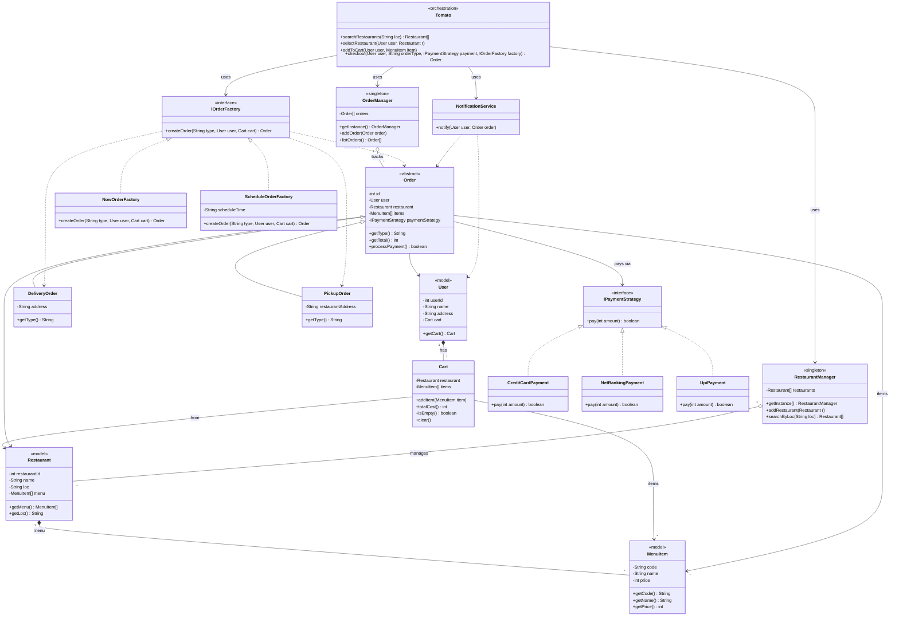

# Zomato — Improved Design (Bottom-up)

Preview this markdown with **Cmd/Ctrl + Shift + V**.

We design a food-delivery app (**Zomato**) **bottom-up**: models first, then managers, then factories & strategies, then a thin notification adapter, and finally the orchestration class `Tomato`.

> **Code:** [`code/`](./code/) — run with `npm run demo:tomato`

Payment is still a **3rd-party concern**, but we teach the **Strategy pattern** with small classes (`CreditCard`, `NetBanking`, `UPI`) that only know _how to call_ the gateway — not how cards or UPI work inside. Notification stays one lean service.

---

## How to explain this (talk track)

When you walk someone through this design, ask questions and fix the requirements completely.
Then create a UML with the requirements and then think all of this:

1. **Models** — What exists in the domain? (`MenuItem`, `Restaurant`, `Cart`, `User`, `Order`)
2. **Singleton managers** — Who owns the lists? (`RestaurantManager`, `OrderManager`)
3. **Factory** — Who builds Delivery vs Pickup (and Now vs Schedule)?
4. **Payment Strategy** — How do we swap UPI / card / net-banking without rewriting checkout?
5. **Tomato** — How does one class wire the happy path for the user?

That matches how the code folder is laid out — easy to open file-by-file while teaching.

---

## Class Diagram



---

## Layering (bottom → top)

| Layer               | Folder             | What                                                                    | Why                                                                     |
| ------------------- | ------------------ | ----------------------------------------------------------------------- | ----------------------------------------------------------------------- |
| 1. Models           | `code/models/`     | `MenuItem`, `Restaurant`, `User`, `Cart`, `Order` (+ Delivery / Pickup) | Pure domain; no I/O                                                     |
| 2. Managers         | `code/managers/`   | `RestaurantManager`, `OrderManager` (**Singleton**)                     | One shared registry to search restaurants / track orders                |
| 3. Factory          | `code/factories/`  | `IOrderFactory` → Now / Schedule                                        | Create Delivery vs Pickup without `if` soup in Tomato                   |
| 4. Payment Strategy | `code/strategies/` | `IPaymentStrategy` → CreditCard / NetBanking / UPI                      | Swap payment method at checkout; each strategy is a thin 3rd-party call |
| 5. Notification     | `code/services/`   | `NotificationService`                                                   | Lean wrapper around a 3rd-party notifier                                |
| 6. Orchestration    | `code/Tomato.ts`   | `Tomato`                                                                | Wires the flow; owns no deep business rules                             |

---

## Pattern deep dives (teach these three hard)

### 1. Singleton — `RestaurantManager` / `OrderManager`

> **One shared instance** for the whole app so everyone searches the same restaurant list and tracks the same orders.

**Why here?**

- Searching restaurants from two different “managers” would show inconsistent catalogs.
- Listing orders should mean _all_ orders, not a private copy per screen.

**How we teach it:**

```typescript
// Private constructor → nobody can `new RestaurantManager()`
// getInstance() → always the same object
RestaurantManager.getInstance().addRestaurant(pizzaHut);
RestaurantManager.getInstance().searchByLoc("Delhi"); // same registry
```

Same idea for `OrderManager` after checkout.

**Interview line:** _“Singleton gives us a single source of truth for restaurants and orders.”_

---

### 2. Factory — `IOrderFactory` (Now / Schedule) → Delivery / Pickup

> Tomato should not know _how_ to construct every order variant. It asks a factory: “give me an order of this type.”

**Two axes we support:**

| Axis          | Variants           | Who decides                                                           |
| ------------- | ------------------ | --------------------------------------------------------------------- |
| When          | Now vs Schedule    | Which factory you inject (`NowOrderFactory` / `ScheduleOrderFactory`) |
| How fulfilled | Delivery vs Pickup | `type` string passed into `createOrder("delivery" \| "pickup", …)`    |

**Why Factory?**

- Adding `ScheduleOrderFactory` does not rewrite `Tomato.checkout`.
- Delivery vs Pickup keep their own fields (`address` vs `restaurantAddress`) behind one `Order` abstraction.

**Interview line:** _“Factory encapsulates object creation so the orchestrator stays open for new order kinds.”_

---

### 3. Strategy — `IPaymentStrategy` (CreditCard / NetBanking / UPI)

> Checkout depends on **how** we pay. Strategy lets us inject that algorithm.

```typescript
order.setPaymentStrategy(new UpiPayment("user@upi"));
order.processPayment(); // Order only calls strategy.pay(amount)
```

**Why Strategy (even with 3rd-party payments)?**

- Real money movement is still Razorpay / Stripe / bank APIs.
- Our strategies stay **tiny**: pick a method, call the gateway, return success/failure.
- Tomato / Order never hard-code `if (method === "upi")`.

**Interview line:** _“Strategy swaps payment algorithms at runtime; Order only knows `pay(amount)`.”_

Notification is **not** a full Strategy hierarchy here — one lean `NotificationService` is enough for “notify after success,” since the vendor owns channels (SMS / push / email).

---

## Flow (matches the sketch)

```
User → Restaurants (by location) → Menu → Cart / Order
         → Delivery | Pickup → Payment (Strategy) → Notification → User
```

Step by step in code:

1. `Tomato.searchRestaurants(loc)` → `RestaurantManager.searchByLoc` (**Singleton**)
2. User picks a restaurant → cart bound to that restaurant
3. `addToCart` → `Cart.addItem`
4. `checkout` →
   - **Factory** builds `DeliveryOrder` or `PickupOrder`
   - **Strategy** runs `pay(total)`
   - `OrderManager.addOrder` (**Singleton**)
   - `NotificationService.notify`
   - cart `clear()`

---

## Folder map (open these while teaching)

```
projects/Design_Zomato/
├── problem_statement.md
├── improved-design_docs.md          ← you are here
└── code/
    ├── models/                      ← domain objects
    │   ├── MenuItem.ts
    │   ├── Restaurant.ts
    │   ├── Cart.ts
    │   ├── User.ts
    │   └── Order.ts
    ├── managers/                    ← Singleton
    │   ├── RestaurantManager.ts
    │   └── OrderManager.ts
    ├── factories/                   ← Factory
    │   ├── IOrderFactory.ts
    │   ├── NowOrderFactory.ts
    │   └── ScheduleOrderFactory.ts
    ├── strategies/                  ← Payment Strategy
    │   ├── IPaymentStrategy.ts
    │   ├── CreditCardPayment.ts
    │   ├── NetBankingPayment.ts
    │   └── UpiPayment.ts
    ├── services/
    │   └── NotificationService.ts   ← lean 3rd-party notify
    ├── Tomato.ts                    ← orchestration
    └── demo.ts                      ← runnable walkthrough
```

---

## What changed vs the whiteboard UML

| Original                             | Improved                                                   | Reason                                      |
| ------------------------------------ | ---------------------------------------------------------- | ------------------------------------------- |
| Payment strategies drawn but unclear | Explicit **Strategy** + thin CreditCard / NetBanking / UPI | Easy to teach; still delegates to 3rd party |
| Notification looked heavy            | Single lean `NotificationService`                          | Vendor owns push/SMS/email                  |
| `Tomato` labeled but not wired       | Explicit orchestration methods + deps                      | Interview-ready: who calls whom             |
| Cart missing `clear()`               | `clear()` after successful checkout                        | Realistic cart lifecycle                    |
| Managers implied                     | Explicit **Singleton** `getInstance()`                     | One catalog, one order list                 |

---

## Patterns used (cheat sheet)

| Pattern                   | Where                                      | One-liner                          |
| ------------------------- | ------------------------------------------ | ---------------------------------- |
| **Singleton**             | `RestaurantManager`, `OrderManager`        | One shared registry                |
| **Factory**               | `IOrderFactory` → Now / Schedule           | Create Delivery / Pickup cleanly   |
| **Strategy**              | `IPaymentStrategy` → CC / NetBanking / UPI | Swap pay algorithm at checkout     |
| **Facade / Orchestrator** | `Tomato`                                   | App flow without owning deep rules |
