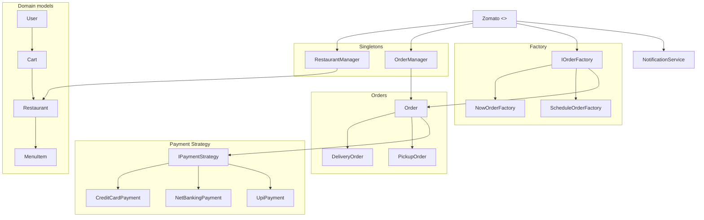
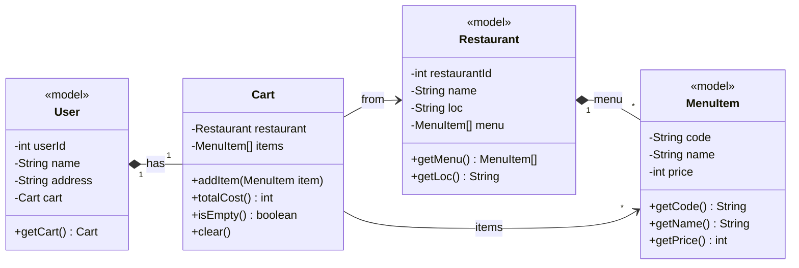
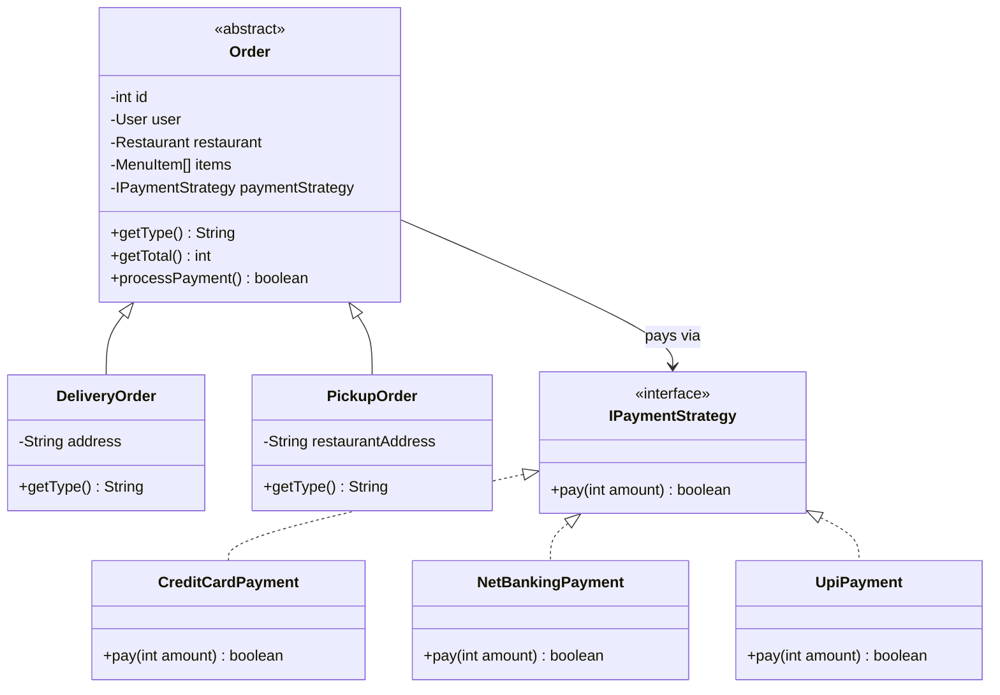
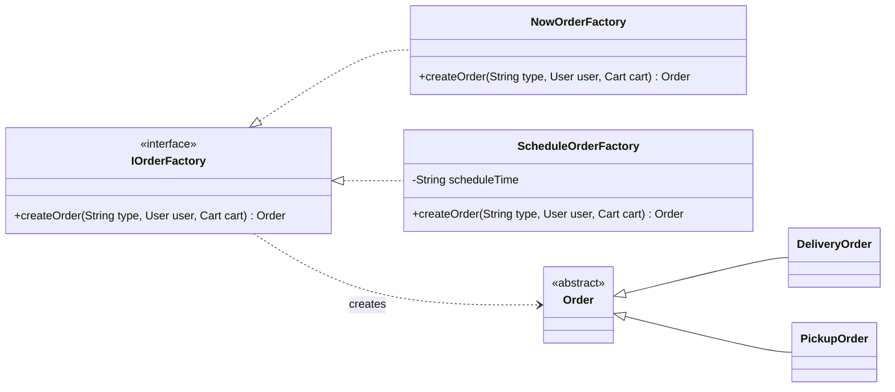
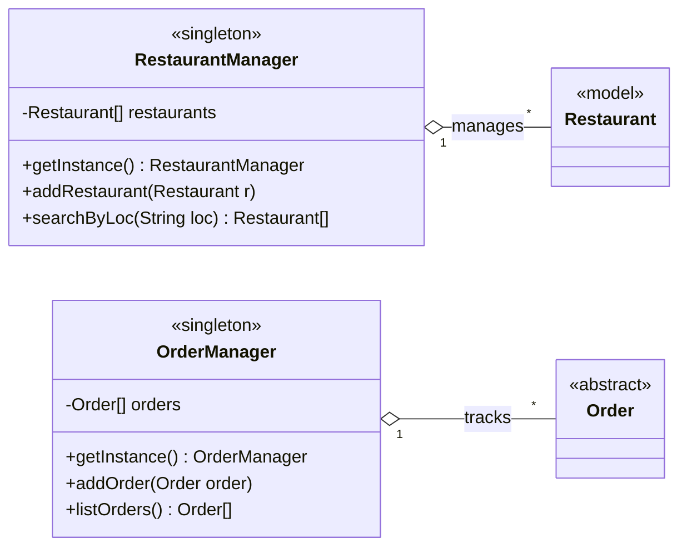
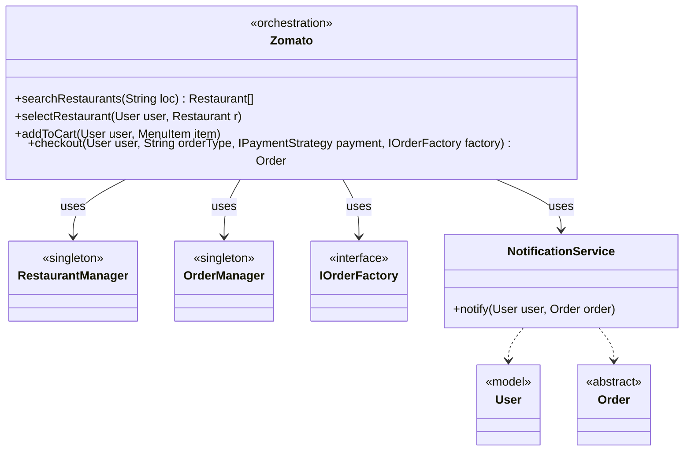

# Zomato — Improved Design (Bottom-up)

Preview this markdown with **Cmd/Ctrl + Shift + V**.

This case study designs a food-delivery app (**Zomato**) **bottom-up**: domain models first, then managers, then factories and payment strategies, then a thin notification service, and finally the orchestration class `Zomato`.

> **Code:** [`code/`](./code/) — run with `npm run demo:zomato`

Payment still goes through a **third-party gateway**. The **Strategy** classes (`CreditCard`, `NetBanking`, `UPI`) only know _how to call_ that gateway — not how cards or UPI work inside. Notification stays one lean service for the same reason.

By the end of this doc you should be able to open any file under `code/` and know why it exists.

---

## How to read this design

Work through the layers in order — the same order the folders are laid out:

1. **Models** — What exists in the domain? (`MenuItem`, `Restaurant`, `Cart`, `User`, `Order`)
2. **Singleton managers** — Who owns the shared lists? (`RestaurantManager`, `OrderManager`)
3. **Factory** — Who builds Delivery vs Pickup (and Now vs Schedule)?
4. **Payment Strategy** — How do you swap UPI / card / net-banking without rewriting checkout?
5. **Zomato** — How does one class wire the happy path for the user?

If a class feels confusing, jump back to the matching diagram below — each section is small enough to stay readable in preview.

---

## Class Diagrams

> One giant diagram shrinks in the preview. These are **focused** diagrams so each layer stays clear. Preview with **Cmd/Ctrl + Shift + V**.

### Overview (names only — big picture)



Start here. `Zomato` sits on top and talks to managers, the factory, and notification. Domain models and payment live underneath. The next diagrams zoom into each box.

---

### 1. Domain models (User · Cart · Restaurant · MenuItem)



These are pure data + simple behaviour — no payment APIs, no databases.

- A **Restaurant** owns a menu of **MenuItem**s.
- A **User** owns one **Cart**.
- The cart points at the restaurant you selected and the items you added.

Everything above this layer builds on these four classes.

---

### 2. Orders + Payment Strategy



An **Order** holds who ordered, from where, which items, and _how_ to pay.

- **DeliveryOrder** needs a delivery `address`.
- **PickupOrder** needs the `restaurantAddress`.
- Both share `getTotal()` and `processPayment()`.

Payment is injected as an **IPaymentStrategy**. The order only calls `pay(amount)` — it never knows whether that means UPI, card, or net banking.

---

### 3. Factory Method — Now vs Schedule



`Zomato` should not construct every order variant by hand. It asks an **IOrderFactory**: “create an order of this type for this user and cart.”

Two decisions live here:

| Axis              | Variants           | Who decides                                                            |
| ----------------- | ------------------ | ---------------------------------------------------------------------- |
| **When**          | Now vs Schedule    | Which factory you pass in (`NowOrderFactory` / `ScheduleOrderFactory`) |
| **How fulfilled** | Delivery vs Pickup | The `type` string: `"delivery"` or `"pickup"`                          |

Adding a new “when” (for example a later factory) means a new class — `Zomato.checkout` stays the same.

---

### 4. Singleton managers



Managers are the **shared registries** for the app:

- **RestaurantManager** — one catalog of restaurants; search by location.
- **OrderManager** — one list of placed orders after checkout.

Both use **Singleton** (`getInstance()`) so every screen sees the same data. Two separate manager instances would mean two catalogs and a broken search.

---

### 5. Orchestration — `Zomato` + Notification



**Zomato** is the facade the demo (and a real app entrypoint) talks to. It does not own deep business rules — it wires the flow:

search → select restaurant → add to cart → checkout → notify.

**NotificationService** is intentionally thin: after a successful order, call `notify(user, order)`. Channels (SMS / push / email) stay with the vendor.

---

## Layering (bottom → top)

| Layer               | Folder             | What                                                                    | Why                                                                     |
| ------------------- | ------------------ | ----------------------------------------------------------------------- | ----------------------------------------------------------------------- |
| 1. Models           | `code/models/`     | `MenuItem`, `Restaurant`, `User`, `Cart`, `Order` (+ Delivery / Pickup) | Pure domain; no I/O                                                     |
| 2. Managers         | `code/managers/`   | `RestaurantManager`, `OrderManager` (**Singleton**)                     | One shared registry to search restaurants / track orders                |
| 3. Factory          | `code/factories/`  | `IOrderFactory` → Now / Schedule                                        | Create Delivery vs Pickup without `if` soup in Zomato                   |
| 4. Payment Strategy | `code/strategies/` | `IPaymentStrategy` → CreditCard / NetBanking / UPI                      | Swap payment method at checkout; each strategy is a thin 3rd-party call |
| 5. Notification     | `code/services/`   | `NotificationService`                                                   | Lean wrapper around a 3rd-party notifier                                |
| 6. Orchestration    | `code/Zomato.ts`   | `Zomato`                                                                | Wires the flow; owns no deep business rules                             |

Read the table top-to-bottom when studying; build features bottom-to-top when coding.

---

## Pattern deep dives

### 1. Singleton — `RestaurantManager` / `OrderManager`

> **One shared instance** for the whole app so everyone searches the same restaurant list and tracks the same orders.

**Why it matters here**

- Two “managers” would show inconsistent restaurant catalogs.
- Listing orders should mean _all_ orders, not a private copy per screen.

**How it looks in code**

```typescript
// Private constructor → nobody can `new RestaurantManager()`
// getInstance() → always the same object
RestaurantManager.getInstance().addRestaurant(pizzaHut);
RestaurantManager.getInstance().searchByLoc("Delhi"); // same registry
```

`OrderManager` works the same way after checkout.

**One-liner:** Singleton gives a single source of truth for restaurants and orders.

---

### 2. Factory — `IOrderFactory` (Now / Schedule) → Delivery / Pickup

> Zomato should not know _how_ to construct every order variant. It asks a factory: “give me an order of this type.”

**Why Factory**

- Adding `ScheduleOrderFactory` does not rewrite `Zomato.checkout`.
- Delivery vs Pickup keep their own fields (`address` vs `restaurantAddress`) behind one `Order` abstraction.

**One-liner:** Factory encapsulates object creation so the orchestrator stays open for new order kinds.

---

### 3. Strategy — `IPaymentStrategy` (CreditCard / NetBanking / UPI)

> Checkout depends on **how** you pay. Strategy lets you inject that algorithm.

```typescript
order.setPaymentStrategy(new UpiPayment("user@upi"));
order.processPayment(); // Order only calls strategy.pay(amount)
```

**Why Strategy (even with third-party payments)**

- Real money movement still lives in Razorpay / Stripe / bank APIs.
- Our strategies stay **tiny**: pick a method, call the gateway, return success or failure.
- Zomato / Order never hard-code `if (method === "upi")`.

**One-liner:** Strategy swaps payment algorithms at runtime; Order only knows `pay(amount)`.

Notification is **not** a Strategy hierarchy here — one lean `NotificationService` is enough for “notify after success,” because the vendor owns the channels.

---

## End-to-end flow

```
User → Restaurants (by location) → Menu → Cart / Order
         → Delivery | Pickup → Payment (Strategy) → Notification → User
```

What happens in code:

1. `Zomato.searchRestaurants(loc)` → `RestaurantManager.searchByLoc` (**Singleton**)
2. User picks a restaurant → cart binds to that restaurant
3. `addToCart` → `Cart.addItem`
4. `checkout` →
   - **Factory** builds `DeliveryOrder` or `PickupOrder`
   - **Strategy** runs `pay(total)`
   - `OrderManager.addOrder` (**Singleton**)
   - `NotificationService.notify`
   - cart `clear()`

Follow that sequence in [`demo.ts`](./code/demo.ts) and the pieces click together.

---

## Folder map

```
projects/Design_Zomato/
├── problem_statement.md
├── improved-design_docs.md          ← you are here
└── code/
    ├── models/                      ← domain objects
    │   ├── MenuItem.ts
    │   ├── Restaurant.ts
    │   ├── Cart.ts
    │   ├── User.ts
    │   └── Order.ts
    ├── managers/                    ← Singleton
    │   ├── RestaurantManager.ts
    │   └── OrderManager.ts
    ├── factories/                   ← Factory
    │   ├── IOrderFactory.ts
    │   ├── NowOrderFactory.ts
    │   └── ScheduleOrderFactory.ts
    ├── strategies/                  ← Payment Strategy
    │   ├── IPaymentStrategy.ts
    │   ├── CreditCardPayment.ts
    │   ├── NetBankingPayment.ts
    │   └── UpiPayment.ts
    ├── services/
    │   └── NotificationService.ts   ← lean 3rd-party notify
    ├── Zomato.ts                    ← orchestration
    └── demo.ts                      ← runnable walkthrough
```

Open folders in the same bottom-up order as the diagrams: models → managers → factories → strategies → Zomato.

---

---

## Patterns used (cheat sheet)

| Pattern                   | Where                                      | One-liner                          |
| ------------------------- | ------------------------------------------ | ---------------------------------- |
| **Singleton**             | `RestaurantManager`, `OrderManager`        | One shared registry                |
| **Factory**               | `IOrderFactory` → Now / Schedule           | Create Delivery / Pickup cleanly   |
| **Strategy**              | `IPaymentStrategy` → CC / NetBanking / UPI | Swap pay algorithm at checkout     |
| **Facade / Orchestrator** | `Zomato`                                   | App flow without owning deep rules |
