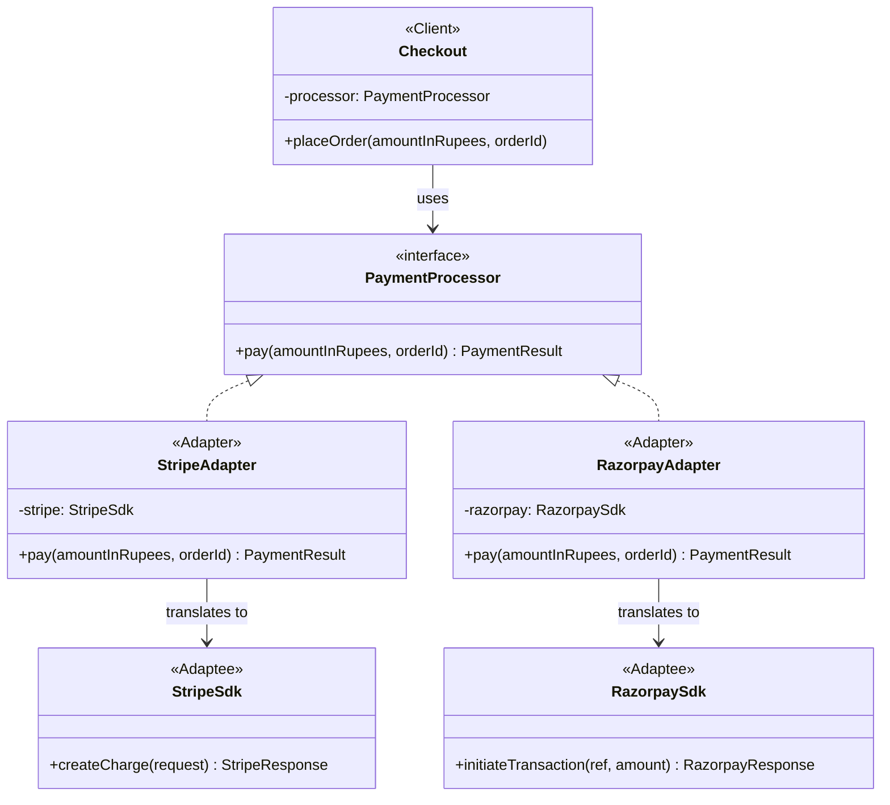
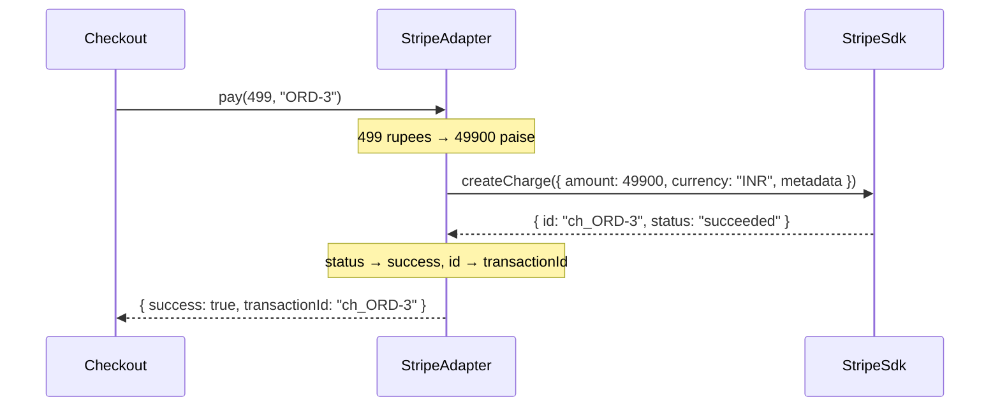

# Adapter — Payment Gateway Integration

> Preview with **Cmd / Ctrl + Shift + V**
>
> **Code:** [`adapter.ts`](./adapter.ts) — run with `npm run demo:adapter`

---

## The situation

You are building checkout for a food-delivery or e-commerce app. The business wants to support two payment gateways — a Stripe-style SDK and a Razorpay-style SDK — and may switch vendors next year.

Your checkout code wants a single, simple contract:

```typescript
interface PaymentProcessor {
  pay(amountInRupees: number, orderId: string): PaymentResult;
}
```

The vendor SDKs were written by other companies. They don't know your interface exists, and you cannot change their code.

---

## Why the SDKs don't fit

|                | Your app wants          | Stripe-style SDK                         | Razorpay-style SDK                    |
| -------------- | ----------------------- | ---------------------------------------- | ------------------------------------- |
| Method         | `pay(amount, orderId)`  | `createCharge(request)`                  | `initiateTransaction(ref, amount)`    |
| Amount         | rupees (`499`)          | paise (`49900`)                          | rupees as a string (`"499.00"`)       |
| Arguments      | two positional values   | one object with `currency` and `metadata` | two positional strings, reversed order |
| Result         | `{ success, transactionId }` | `{ id, status: "succeeded" }`       | `{ txnRef, code: 200 }`               |

Every row is a mismatch. That is exactly the gap an adapter fills.

---

## Without Adapter

Checkout calls each SDK directly:

```typescript
if (gateway === "stripe") {
  const res = new StripeSdk().createCharge({
    amount: amountInRupees * 100,
    currency: "INR",
    metadata: { ref: orderId },
  });
  // check res.status === "succeeded"
} else if (gateway === "razorpay") {
  const res = new RazorpaySdk().initiateTransaction(orderId, amountInRupees.toFixed(2));
  // check res.code === 200
}
```

This works for one screen. Then refunds, retries, and payment reports each need the same branching, and a vendor change means editing all of them.

---

## UML



**Reading the UML:** `Checkout` points only at `PaymentProcessor`. Each adapter implements that interface and holds one vendor SDK. The SDKs sit at the bottom, unchanged — nothing in the diagram points from them back up to your code.

---

## Inside an adapter

Each adapter does three things: convert the input, call the vendor, and convert the output.

```typescript
export class StripeAdapter implements PaymentProcessor {
  constructor(private readonly stripe: StripeSdk) {}

  pay(amountInRupees: number, orderId: string): PaymentResult {
    // 1. Convert input: rupees → paise, positional args → request object
    const response = this.stripe.createCharge({
      amount: Math.round(amountInRupees * 100),
      currency: "INR",
      metadata: { ref: orderId },
    });

    // 2. Convert output: vendor response → your PaymentResult
    return {
      success: response.status === "succeeded",
      transactionId: response.id,
    };
  }
}
```

`RazorpayAdapter` follows the same shape with different translations: the number becomes a string, the arguments are reordered, and `code === 200` becomes `success: true`.

---

## Using it

```typescript
const checkout = new Checkout(new StripeAdapter(new StripeSdk()));
checkout.placeOrder(499, "ORD-3");

// Switch vendors — Checkout is unchanged
const other = new Checkout(new RazorpayAdapter(new RazorpaySdk()));
other.placeOrder(199, "ORD-4");
```

`Checkout` never imports a vendor SDK. Choosing a gateway is a one-line decision at the place where objects are created.

---

## Sequence of a single payment



The translation happens twice — once on the way in and once on the way out. Checkout only ever sees its own types.

---

## What you gain

|                          | Direct SDK calls                  | Adapter                                   |
| ------------------------ | --------------------------------- | ----------------------------------------- |
| Add a new gateway        | Edit every place that pays        | Write one new adapter class               |
| Vendor changes its API   | Hunt through business code        | Fix one adapter                           |
| Unit-test checkout       | Needs a real or patched SDK       | Pass a fake `PaymentProcessor`            |
| Where vendor details live | Scattered across the app         | One class per vendor                      |

---

## Adapter vs Strategy

In this example the adapters are also interchangeable, which can look like Strategy. The difference is **why** each class exists:

- **Strategy** — you wrote several algorithms and want to pick one at runtime (Card vs UPI rules you own).
- **Adapter** — someone else wrote a class with the wrong shape, and you need it to fit your interface.

In real projects the two often combine: your payment strategies are frequently adapters around vendor SDKs. The Zomato case study's `UpiPayment` and `CreditCardPayment` classes are a small example of this.

---

## Run it

```bash
npm run demo:adapter
```

The demo first runs the branching checkout, then the adapter version. Both charge the same amounts, but in the second half `Checkout` has no idea which vendor it is talking to.
