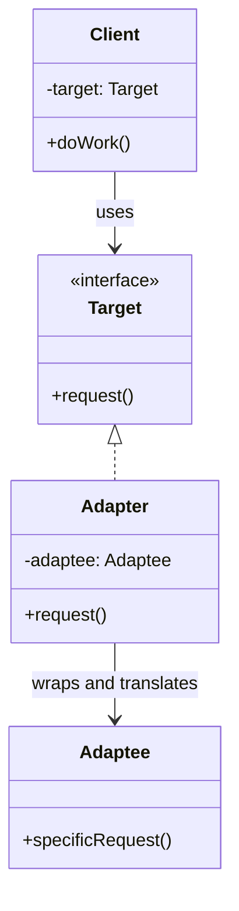

# Adapter Pattern — Understanding the Idea

> Preview with **Cmd / Ctrl + Shift + V**

---

## Definition

> **Adapter** is a structural design pattern that lets two objects with **incompatible interfaces** work together. The adapter wraps one object and translates calls from the interface your code expects into the interface that object actually has.

In plain words:

> _"Your code speaks one language. The library speaks another. The adapter is the translator in the middle."_

Also known as: **Wrapper** (the same word Decorator uses — the difference is explained below).

---

## A real-world analogy

You travel from India to the UK. Your laptop charger has an Indian plug; the wall has a UK socket.

- You do **not** rewire the laptop.
- You do **not** rebuild the wall.
- You plug in a **travel adapter**.

The laptop is your app, the wall socket is the third-party library, and the travel adapter is the Adapter class.

---

## What problem does it solve?

Your checkout expects every payment gateway to look like this:

```typescript
interface PaymentProcessor {
  pay(amountInRupees: number, orderId: string): PaymentResult;
}
```

But the real SDKs look nothing like it:

| SDK            | Method                                  | Amount format        | Success check              |
| -------------- | --------------------------------------- | -------------------- | -------------------------- |
| Stripe-style   | `createCharge({ amount, currency, … })` | paise (number × 100) | `status === "succeeded"`   |
| Razorpay-style | `initiateTransaction(ref, amount)`      | rupees as a string   | `code === 200`             |

You cannot edit vendor code. Without an adapter, checkout ends up full of vendor branches:

```typescript
if (gateway === "stripe") {
  stripe.createCharge({ amount: amount * 100, currency: "INR", ... });
} else if (gateway === "razorpay") {
  razorpay.initiateTransaction(orderId, amount.toFixed(2));
}
```

Problems:

1. **Tight coupling** — checkout knows every vendor's method names and units
2. **Repetition** — refunds, retries, and reports copy the same branches
3. **Risky vendor switches** — replacing a gateway means editing business code
4. **Hard to test** — you cannot fake the gateway without touching checkout

The Adapter pattern moves each vendor's translation into its own class. Checkout only ever calls `processor.pay(...)`.

---

## Standard UML



**Reading the UML:** the **Client** depends only on the **Target** interface. The **Adapter** implements Target, holds a reference to the **Adaptee**, and turns each `request()` into the matching `specificRequest()`. The Adaptee never changes, and the Client never learns it exists.

| Role        | Meaning                                         | In our example                     |
| ----------- | ----------------------------------------------- | ---------------------------------- |
| **Target**  | The interface your code wants                   | `PaymentProcessor`                 |
| **Adaptee** | The existing class with an incompatible API     | `StripeSdk`, `RazorpaySdk`         |
| **Adapter** | Implements Target, delegates to the Adaptee     | `StripeAdapter`, `RazorpayAdapter` |
| **Client**  | Code that only talks to Target                  | `Checkout`                         |

---

## Core flow

```
checkout.placeOrder(499, "ORD-3")
        │
        ▼
processor.pay(499, "ORD-3")            ← Target interface
        │
        ▼
StripeAdapter.pay(...)                 ← translation happens here
   • 499 rupees → 49900 paise
   • builds { amount, currency, metadata }
        │
        ▼
stripeSdk.createCharge({...})          ← Adaptee (vendor code)
        │
        ▼
{ id, status } → { success, transactionId }   ← response translated back
```

An adapter translates in **both directions**: the request going in and the response coming back.

---

## Object adapter vs class adapter

| Style              | How it works                                     | In TypeScript                      |
| ------------------ | ------------------------------------------------ | ---------------------------------- |
| **Object adapter** | Adapter **holds** an adaptee instance (composition) | The normal choice — used in this lesson |
| **Class adapter**  | Adapter **extends** the adaptee (inheritance)    | Rare; ties you to one concrete class |

Prefer the object adapter. It works with any instance you pass in, including fakes in tests.

---

## Adapter vs Decorator vs Facade

All three wrap something, which makes them easy to mix up.

| Pattern       | Interface after wrapping          | Purpose                                   |
| ------------- | --------------------------------- | ----------------------------------------- |
| **Adapter**   | **Different** from the wrapped object | Make an incompatible API fit your code |
| **Decorator** | **Same** as the wrapped object    | Add behaviour on top                      |
| **Facade**    | A new, **simpler** interface over many objects | Hide a complex subsystem       |

A quick test: if the wrapper exists because the names and shapes don't match, it is an Adapter.

---

## When to use Adapter

| Use it when…                                               | Skip it when…                                   |
| ---------------------------------------------------------- | ----------------------------------------------- |
| Integrating third-party SDKs or APIs                        | You own both sides and can just change the code |
| Migrating from a legacy system without rewriting callers    | The interfaces already match                    |
| You want to swap vendors without touching business logic    | There is only one vendor and it won't change    |
| Converting data formats (XML → JSON, callbacks → Promises)  | A one-line helper function is enough            |

Real-world cousins in JavaScript:

- **`util.promisify`** — adapts callback-style Node APIs into Promise-returning functions
- **ORM drivers** — one query API over Postgres, MySQL, and SQLite
- **Storage wrappers** — one `get`/`set` interface over `localStorage`, cookies, or IndexedDB
- **Analytics wrappers** — one `track(event)` over Google Analytics, Mixpanel, or Segment

---

## SOLID connection

| Principle | How Adapter helps                                                        |
| --------- | ------------------------------------------------------------------------ |
| **S**     | Translation logic lives in the adapter, not in business code             |
| **O**     | A new vendor means a new adapter; checkout stays closed for modification |
| **D**     | Checkout depends on `PaymentProcessor`, not on any vendor SDK            |

---

## Lesson in this folder

| Resource                   | What                                        |
| -------------------------- | ------------------------------------------- |
| [adapter.md](./adapter.md) | Payment gateway integration walkthrough     |
| [adapter.ts](./adapter.ts) | Bad vendor branching vs Adapter per gateway |

```bash
npm run demo:adapter
```

---

## One-liner

> _"Adapter wraps an incompatible class and translates its API into the interface your code already expects — so you integrate without rewriting either side."_
