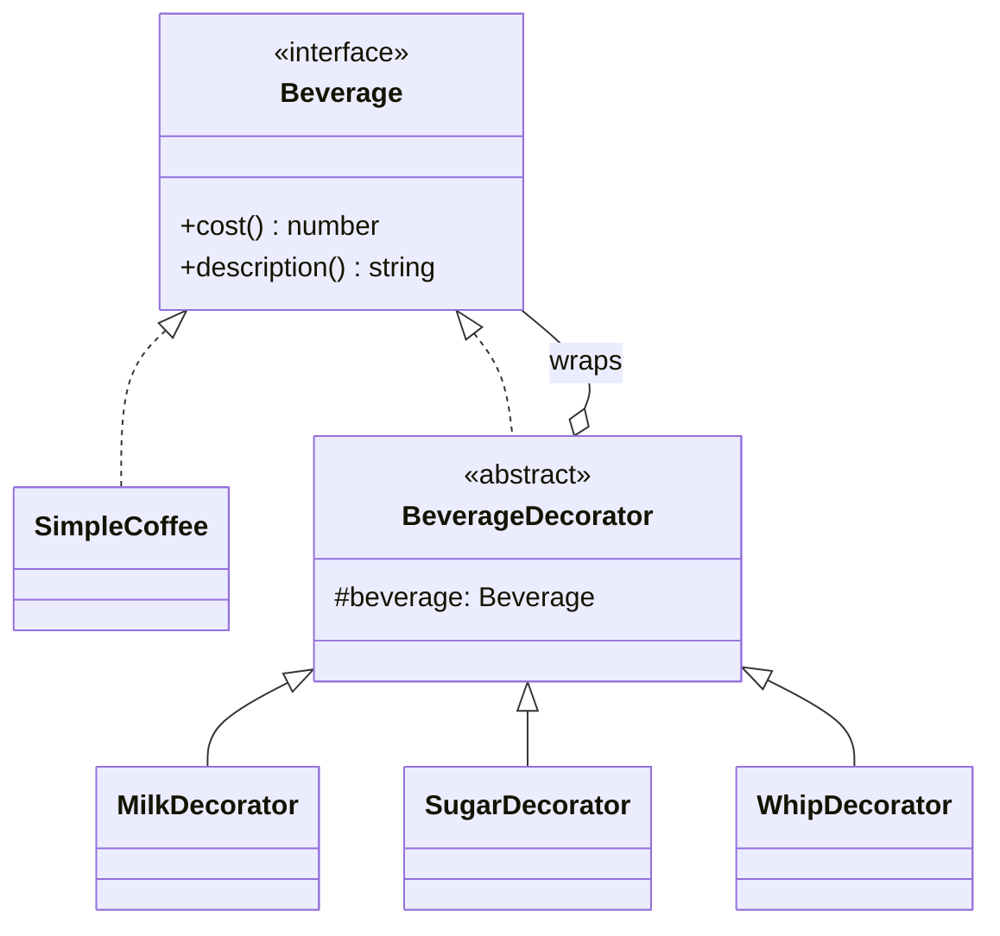

# Decorator — Coffee Shop Toppings

> Preview with **Cmd / Ctrl + Shift + V**
>
> **Code:** [`decorator.ts`](./decorator.ts) — run with `npm run demo:decorator`

---

## Definition

> Wrap a beverage with toppings. Each topping is a decorator that implements the same `Beverage` interface and adds cost + description.

**One sentence:**

> `new Whip(new Milk(new SimpleCoffee()))` — same interface, layered behaviour.

---

## Why not just inheritance?

| Inheritance | Decorator |
|-------------|-----------|
| `MilkSugarCoffee` subclass for each combo | Stack wrappers in any order |
| Fixed at compile time | Chosen at runtime |
| Hard to extend | New topping = one new class |

---

## UML



**Reading the UML:** `SimpleCoffee` is the core. `BeverageDecorator` holds a `Beverage` reference. Milk / Sugar / Whip extend the decorator and add their own cost and label. Because the decorator *is a* Beverage, you can wrap a wrap.

---

## How it works

```typescript
let order: Beverage = new SimpleCoffee();
order = new MilkDecorator(order);
order = new SugarDecorator(order);

console.log(order.description()); // Simple coffee, milk, sugar
console.log(order.cost());        // 2.7
```

Each `cost()` / `description()` calls the inner object first, then adds itself.

---

## Run it

```bash
npm run demo:decorator
```
