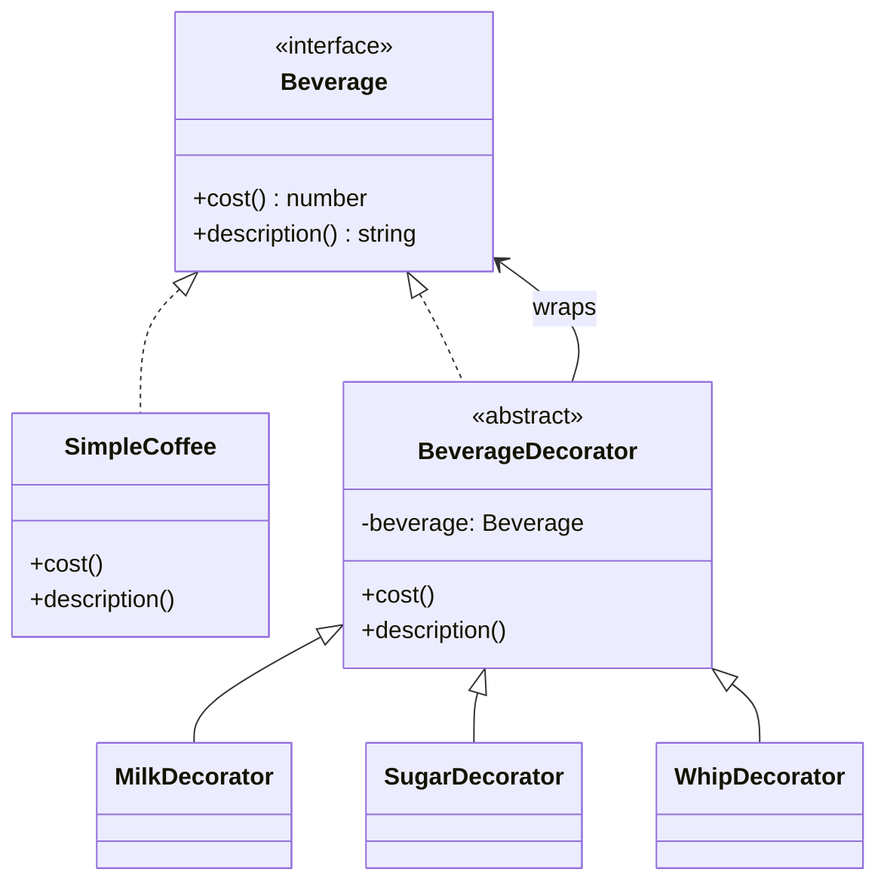

# Decorator Pattern — Understanding the Idea

> Preview with **Cmd / Ctrl + Shift + V**

---

## Definition

> **Decorator** is a structural design pattern that lets you **attach new behaviour to an object by wrapping it** inside another object that implements the **same interface**.

In plain words:

> *"Don't subclass every combo. Wrap the base object with toppings — each wrapper adds a little something."*

Also known as: **Wrapper**.

---

## The problem it solves

Without Decorator, coffee toppings explode into subclasses:

```typescript
class Coffee {}
class CoffeeWithMilk {}
class CoffeeWithSugar {}
class CoffeeWithMilkAndSugar {}
class CoffeeWithMilkSugarAndWhip {}
// ... combinatorial explosion
```

Problems:

1. **Class explosion** — every combo needs a new subclass
2. **Rigid** — hard to add a topping at runtime
3. **Inheritance misuse** — inheritance is for “is-a”, not “add-on”

Decorator says: keep one `SimpleCoffee`, then wrap it: `new Milk(new Sugar(new SimpleCoffee()))`.

---

## Standard shape



**Reading the UML:** Everyone implements `Beverage`. `BeverageDecorator` holds another `Beverage` and forwards calls — concrete decorators add milk / sugar / whip on top. Wrappers and the base share one interface, so you can stack them freely.

---

## Core flow

```
order = new SimpleCoffee()           // $2, "Simple coffee"
order = new MilkDecorator(order)     // +$0.5
order = new SugarDecorator(order)    // +$0.2
order = new WhipDecorator(order)     // +$0.7

order.cost()         // 3.4
order.description()  // Simple coffee, milk, sugar, whip
```

Each decorator calls the inner beverage, then adds its own bit.

---

## When to use Decorator

| Use it when… | Skip it when… |
|--------------|---------------|
| You need optional add-ons in any combination | You only ever have 1–2 fixed variants |
| You want to add behaviour at **runtime** | A single subclass is enough |
| Inheritance would create too many combo classes | The “extra” behaviour changes the core identity |

Real-world cousins in JS: middleware stacks, Node streams, React HOCs / wrappers, `InputStream` wrappers in other languages.

---

## SOLID connection

| Principle | How Decorator helps |
|-----------|---------------------|
| **O** | New topping = new decorator class; base coffee stays closed |
| **S** | Each decorator adds one concern (milk / sugar / whip) |
| **D** | Client depends on `Beverage`, not on a specific combo class |

---

## Lesson in this folder

| Resource | What |
|----------|------|
| [decorator.md](./decorator.md) | Coffee shop example + UML walkthrough |
| [decorator.ts](./decorator.ts) | Runnable demo |

```bash
npm run demo:decorator
```

---

## Interview one-liner

> *"Decorator wraps an object that shares the same interface and adds behaviour dynamically — stack wrappers instead of exploding subclasses."*
